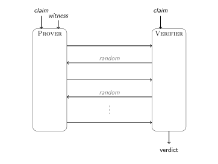
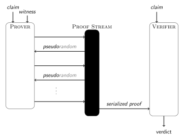

# Anatomy of a STARK, Part 2: Basic Tools

## Finite Field Arithmetic

[Finite field](https://en.wikipedia.org/wiki/Finite_field)s are ubiquitous throughout cryptography because they are natively compatible with computers. For instance, they cannot generate overflow or underflow errors, and their elements have a finite representation in terms of bits.

The easiest way to build a finite field is to select a prime number $p$, use the elements $\mathbb{F}_p \stackrel{\triangle}{=} \lbrace 0, 1, \ldots, p-1\rbrace$, and define the usual addition and multiplication operations in terms of their counterparts for the integers, followed by reduction modulo $p$. Subtraction is equivalent to addition of the left hand side to the negation of the right hand side, and negation represents multiplication by $-1 \equiv p-1 \mod p$. Similarly, division is equivalent to multiplication of the left hand side by the multiplicative inverse of the right hand side. This inverse can be found using the [extended Euclidean algorithm](https://en.wikipedia.org/wiki/Extended_Euclidean_algorithm), which on input two integers $x$ and $y$, returns their greatest common divisor $g$ along with matching Bezout coefficients $a, b$ such that $ax + by = g$. Indeed, whenever $\gcd(x,p) = 1$ the inverse of $x \in \mathbb{F}_p$ is $a$ because $ax + bp \equiv 1 \mod p$. Powers of field elements can be computed with the [square-and-multiply](https://en.wikipedia.org/wiki/Exponentiation_by_squaring) algorithm, which iterates over the bits in the expansion of the exponent, squares an accumulator variable in each iteration, and additionally multiplies it by the base element if the bit is set.

For the purpose of building STARKs we need finite fields with a particular structure[^1]: it needs to contain a substructure of order $2^k$ for some sufficiently large $k$. We consider prime fields whose defining modulus has the form $p = f \cdot 2^k + 1$, where $f$ is some cofactor that makes the number prime. In this case, the group $\mathbb{F}_p \backslash \lbrace 0\rbrace, \times$ has a subgroup of order $2^k$. For all intents and purposes, one can identify this subgroup with $2^k$ evenly spaced points on the complex unit circle.

An implementation starts with the extended Euclidean algorithm, for computing multiplicative inverses.
```python
def xgcd( x, y ):
    old_r, r = (x, y)
    old_s, s = (1, 0)
    old_t, t = (0, 1)

    while r != 0:
        quotient = old_r // r
        old_r, r = (r, old_r - quotient * r)
        old_s, s = (s, old_s - quotient * s)
        old_t, t = (t, old_t - quotient * t)

    return old_s, old_t, old_r # a, b, g
```

It makes sense to separate the logic concerning the field from the logic concerning the field elements. To this end, the field element contains a field object as a proper field; this field object implements the arithmetic. Furthermore, python supports operator overloading, so we can repurpose natural arithmetic operators to do field arithmetic instead.

```python
class FieldElement:
    def __init__( self, value, field ):
        self.value = value
        self.field = field

    def __add__( self, right ):
        return self.field.add(self, right)

    def __mul__( self, right ):
        return self.field.multiply(self, right)

    def __sub__( self, right ):
        return self.field.subtract(self, right)

    def __truediv__( self, right ):
        return self.field.divide(self, right)

    def __neg__( self ):
        return self.field.negate(self)

    def inverse( self ):
        return self.field.inverse(self)

    # modular exponentiation -- be sure to encapsulate in parentheses!
    def __xor__( self, exponent ):
        acc = FieldElement(1, self.field)
        val = FieldElement(self.value, self.field)
        for i in reversed(range(len(bin(exponent)[2:]))):
            acc = acc * acc
            if (1 << i) & exponent != 0:
                acc = acc * val
        return acc

    def __eq__( self, other ):
        return self.value == other.value

    def __neq__( self, other ):
        return self.value != other.value

    def __str__( self ):
        return str(self.value)

    def __bytes__( self ):
        return bytes(str(self).encode())

    def is_zero( self ):
        if self.value == 0:
            return True
        else:
            return False

class Field:
    def __init__( self, p ):
        self.p = p

    def zero( self ):
        return FieldElement(0, self)

    def one( self ):
        return FieldElement(1, self)

    def multiply( self, left, right ):
        return FieldElement((left.value * right.value) % self.p, self)

    def add( self, left, right ):
        return FieldElement((left.value + right.value) % self.p, self)

    def subtract( self, left, right ):
        return FieldElement((self.p + left.value - right.value) % self.p, self)

    def negate( self, operand ):
        return FieldElement((self.p - operand.value) % self.p, self)

    def inverse( self, operand ):
        a, b, g = xgcd(operand.value, self.p)
        return FieldElement(a, self)

    def divide( self, left, right ):
        assert(not right.is_zero()), "divide by zero"
        a, b, g = xgcd(right.value, self.p)
        return FieldElement(left.value * a % self.p, self)
```

Implementing fields generically is nice. However, in this tutorial we will not use any other field than the one with $1+407 \cdot 2^{119}$ elements. This field has a sufficiently large subgroup of power-of-two order.

```python
    def main():
        p = 1 + 407 * ( 1 << 119 ) # 1 + 11 * 37 * 2^119
        return Field(p)
```

Besides ensuring that the subgroup of power-of-two order exists, the code also needs to supply the user with a generator for the entire multiplicative group, as well as the power-of-two subgroups. A generator for such a subgroup of order $n$ will be called a primitive $n$th root.

```python
    def generator( self ):
        assert(self.p == 1 + 407 * ( 1 << 119 )), "Do not know generator for other fields beyond 1+407*2^119"
        return FieldElement(85408008396924667383611388730472331217, self)
        
    def primitive_nth_root( self, n ):
        if self.p == 1 + 407 * ( 1 << 119 ):
            assert(n <= 1 << 119 and (n & (n-1)) == 0), "Field does not have nth root of unity where n > 2^119 or not power of two."
            root = FieldElement(85408008396924667383611388730472331217, self)
            order = 1 << 119
            while order != n:
                root = root^2
                order = order/2
            return root
        else:
            assert(False), "Unknown field, can't return root of unity."
```

Lastly, the protocol requires the ability to sample field elements randomly and pseudorandomly. To do this, the user supplies random bytes and the field logic turns them into a field element. The user should take care to provide enough random bytes.

```python
    def sample( self, byte_array ):
        acc = 0
        for b in byte_array:
            acc = (acc << 8) ^ int(b)
        return FieldElement(acc % self.p, self)
```

## Univariate Polynomials

A *univariate polynomial* is a weighted sum of non-negative powers of a single formal indeterminate. We write polynomials as a formal sum of terms, *i.e.*, $f(X) = c_0 + c_1 \cdot X + \cdots + c_d X^d$ or $f(X) = \sum_{i=0}^d c_i X^i$ because a) the value of the indeterminate $X$ is generally unknown and b) this form emphasises the polynomial's semantic origin and is thus more conducive to building intuition. In these expressions, the $c_i$ are called *coefficients* and $d$ is the polynomial's *degree*.

Univariate polynomials are immensely useful in proof systems because relations that apply to their coefficient vectors extend to their values on a potentially much larger domain. If polynomials are equal, they are equal everywhere; whereas if they are unequal, they are unequal almost everywhere. By this feature, univariate polynomials reduce claims about large vectors to claims about the values of their corresponding polynomials in a small selection of sufficiently random points. 

An implementation of univariate polynomial algebra starts with overloading the standard arithmetic operators to compute the right function of the polynomials' coefficient vectors. One important point requires special attention. It is impossible for the *leading coefficient* of a polynomial to be zero, since the leading coefficient means the coefficient of the highest-degree *non-zero* term. However, the implemented vector of coefficients might have trailing zeros, which should be ignored for all intents and purposes. The degree function comes in handy; it is defined here as one less than the length of the vector of coefficients after ignoring trailing zeros. This also means that the zero polynomial has degree $-1$ even though $-\infty$ makes more sense.

```python
from algebra import *

class Polynomial:
    def __init__( self, coefficients ):
        self.coefficients = [c for c in coefficients]

    def degree( self ):
        if self.coefficients == []:
            return -1
        zero = self.coefficients[0].field.zero()
        if self.coefficients == [zero] * len(self.coefficients):
            return -1
        maxindex = 0
        for i in range(len(self.coefficients)):
            if self.coefficients[i] != zero:
                maxindex = i
        return maxindex

    def __neg__( self ):
        return Polynomial([-c for c in self.coefficients])

    def __add__( self, other ):
        if self.degree() == -1:
            return other
        elif other.degree() == -1:
            return self
        field = self.coefficients[0].field
        coeffs = [field.zero()] * max(len(self.coefficients), len(other.coefficients))
        for i in range(len(self.coefficients)):
            coeffs[i] = coeffs[i] + self.coefficients[i]
        for i in range(len(other.coefficients)):
            coeffs[i] = coeffs[i] + other.coefficients[i]
        return Polynomial(coeffs)

    def __sub__( self, other ):
        return self.__add__(-other)

    def __mul__(self, other ):
        if self.coefficients == [] or other.coefficients == []:
            return Polynomial([])
        zero = self.coefficients[0].field.zero()
        buf = [zero] * (len(self.coefficients) + len(other.coefficients) - 1)
        for i in range(len(self.coefficients)):
            if self.coefficients[i].is_zero():
                continue # optimization for sparse polynomials
            for j in range(len(other.coefficients)):
                buf[i+j] = buf[i+j] + self.coefficients[i] * other.coefficients[j]
        return Polynomial(buf)

    def __eq__( self, other ):
        if self.degree() != other.degree():
            return False
        if self.degree() == -1:
            return True
        return all(self.coefficients[i] == other.coefficients[i] for i in range(len(self.coefficients)))

    def __neq__( self, other ):
        return not self.__eq__(other)

    def is_zero( self ):
        if self.degree() == -1:
            return True
        return False

    def leading_coefficient( self ):
        return self.coefficients[self.degree()]
```

This always get a little tricky when implementing division of polynomials. The intuition behind the schoolbook algorithm is that in every iteration you multiply the dividend by the correct term so as to generate a cancellation of leading terms. Once no such term exists, you have your remainder.

```python
    def divide( numerator, denominator ):
        if denominator.degree() == -1:
            return None
        if numerator.degree() < denominator.degree():
            return (Polynomial([]), numerator)
        field = denominator.coefficients[0].field
        remainder = Polynomial([n for n in numerator.coefficients])
        quotient_coefficients = [field.zero() for i in range(numerator.degree()-denominator.degree()+1)]
        for i in range(numerator.degree()-denominator.degree()+1):
            if remainder.degree() < denominator.degree():
                break
            coefficient = remainder.leading_coefficient() / denominator.leading_coefficient()
            shift = remainder.degree() - denominator.degree()
            subtractee = Polynomial([field.zero()] * shift + [coefficient]) * denominator
            quotient_coefficients[shift] = coefficient
            remainder = remainder - subtractee
        quotient = Polynomial(quotient_coefficients)
        return quotient, remainder

    def __truediv__( self, other ):
        quo, rem = Polynomial.divide(self, other)
        assert(rem.is_zero()), "cannot perform polynomial division because remainder is not zero"
        return quo

    def __mod__( self, other ):
        quo, rem = Polynomial.divide(self, other)
        return rem
```

In terms of basic arithmetic operations, it is worth including a powering map, although mostly for notational easy rather than performance.

```python
    def __xor__( self, exponent ):
        if self.is_zero():
            return Polynomial([])
        if exponent == 0:
            return Polynomial([self.coefficients[0].field.one()])
        acc = Polynomial([self.coefficients[0].field.one()])
        for i in reversed(range(len(bin(exponent)[2:]))):
            acc = acc * acc
            if (1 << i) & exponent != 0:
                acc = acc * self
        return acc
```

A polynomial is quite pointless if it does not admit the computation of its value in a given arbitrary point. For STARKs we need someting more general -- polynomial evaluation on a *domain* of values, rather in a single point. Performance is not a concern at this point so the following implementation follows a straightforward iterative method. Conversely, STARKs also require polynomial interpolation where the x-coordinates are another known range of values. Once again, performance is not an immediate issue so for the time being standard [Lagrange interpolation](https://en.wikipedia.org/wiki/Lagrange_polynomial) suffices.

```python
    def evaluate( self, point ):
        xi = point.field.one()
        value = point.field.zero()
        for c in self.coefficients:
            value = value + c * xi
            xi = xi * point
        return value

    def evaluate_domain( self, domain ):
        return [self.evaluate(d) for d in domain]

    def interpolate_domain( domain, values ):
        assert(len(domain) == len(values)), "number of elements in domain does not match number of values -- cannot interpolate"
        assert(len(domain) > 0), "cannot interpolate between zero points"
        field = domain[0].field
        x = Polynomial([field.zero(), field.one()])
        acc = Polynomial([])
        for i in range(len(domain)):
            prod = Polynomial([values[i]])
            for j in range(len(domain)):
                if j == i:
                    continue
                prod = prod * (x - Polynomial([domain[j]])) * Polynomial([(domain[i] - domain[j]).inverse()])
            acc = acc + prod
        return acc
```

Speaking of domains: one thing that recurs time and again is the computation of polynomials that vanish on them. Any such polynomial is the multiple of $Z_D(X) = \prod_{d \in D} (X-d)$, the unique monic[^2] lowest-degree polynomial that takes the value 0 in all the points of $D$. This polynomial is usually called the *vanishing polynomial* and sometimes the *zerofier*. This tutorial prefers the second term.

```python
    def zerofier_domain( domain ):
        field = domain[0].field
        x = Polynomial([field.zero(), field.one()])
        acc = Polynomial([field.one()])
        for d in domain:
            acc = acc * (x - Polynomial([d]))
        return acc
```

Another useful tool is the ability to *scale* polynomials. Specifically, this means obtaining the vector of coefficients of $f(c \cdot X)$ from that of $f(X)$. This function is particularly useful when $f(X)$ is defined to take a sequence of values on the powers of $c$: $v_i = f(c^i)$. Then $f(c \cdot X)$ represents the same sequence of values but shifted by one position.

```python
    def scale( self, factor ):
        return Polynomial([(factor^i) * self.coefficients[i] for i in range(len(self.coefficients))])
```

The last function that belongs to the univariate polynomial module anticipates a key operations in the FRI protocol, namely testing whether a triple of points fall on the same line -- a fancy word for which is *colinearity*.

```python
def test_colinearity( points ):
    domain = [p[0] for p in points]
    values = [p[1] for p in points]
    polynomial = Polynomial.interpolate_domain(domain, values)
    return polynomial.degree() == 1
```

Before moving on to the next section, it is worth pausing to note that all ingredients are in place for *finite extension fields*, or simply *extension fields*. A finite field is simply a set equipped with addition and multiplication operators that behave according to high school algebra rules, *e.g.* every nonzero element has an inverse, or no two nonzero elements multiplied give zero. There are two ways to obtain them:
 1. Start with the set of integers, and reduce the result of any addition or multiplication modulo a given prime number $p$.
 2. Start with the set of polynomials over a finite field, and reduce the result of any addition or multiplication modulo a given *irreducible polynomial* $p(X)$. A polynomial is *irreducible* when it cannot be decomposed as the product of two smaller polynomials, analogously to prime numbers.

 The point is that it is possible to do the arithmetization in a smaller field than cryptographic compilation step, as long as the latter step uses an extension field of that of the former. Specifically and for example, [Distaff VM](https://github.com/GuildOfWeavers/distaff) operates over the finite field defined by a 64-bit prime, but the FRI step operates over an extension field thereof in order to target 128 bits of security.

 This tutorial will not use extension fields, and so an elaborate discussion of the topic is out of scope.

## Multivariate Polynomials

*Multivariate polynomials* generalize univariate polynomials to many indeterminates -- not just $X$, but $X, Y, Z, \ldots$. Where univariate polynomials are useful for reducing big claims about large vectors to small claims about scalar values in random points, multivariate polynomials are useful for articulating the arithmetic constraints that an integral computation satisfies.

For example, consider the [arithmetic-geometric mean](https://en.wikipedia.org/wiki/Arithmetic%E2%80%93geometric_mean), which is defined as the limit of either the first or second coordinate (which are equal in the limit) of the sequence $(a, b) \mapsto \left( \frac{a+b}{2}, \sqrt{a \cdot b} \right)$, for a giving starting point $(a_0, b_0)$. In order to prove the integrity of several iterations of this process[^3], what is needed is a set of multivariate polynomials that capture the constraint of the correct application of a single iteration relates the current state, $X_0, X_1$ to the next state, $Y_0, Y_1$. In this phrase, the word *capture* means that the polynomial evaluates to zero if the computation is integral. These polynomials might be $m_0(X_0, X_1, Y_0, Y_1) = Y_0 - \frac{X_0 + X_1}{2}$ and $m_1(X_0, X_1, Y_0, Y_1) = Y_1^2 - X_0 \cdot X_1$. (Note that the natural choice $m_1(X_0, X_1, Y_0, Y_1) = Y_1 - \sqrt{X_0 \cdot X_1}$ is not in fact a polynomial, but has the same zeros.)

Where the natural structure for implementing univariate polynomials is a list of coefficients, the natural structure for multivariate polynomials is a dictionary mapping exponent vectors to coefficients. Whenever this dictionary contains zero coefficients, these should be ignored. As usual, the first step is to overload the standard arithmetic operators, basic constructors, and standard functionalities.

```python
class MPolynomial:
    def __init__( self, dictionary ):
        self.dictionary = dictionary

    def zero():
        return MPolynomial(dict())

    def __add__( self, other ):
        dictionary = dict()
        num_variables = max([len(k) for k in self.dictionary.keys()] + [len(k) for k in other.dictionary.keys()])
        for k, v in self.dictionary.items():
            pad = list(k) + [0] * (num_variables - len(k))
            pad = tuple(pad)
            dictionary[pad] = v
        for k, v in other.dictionary.items():
            pad = list(k) + [0] * (num_variables - len(k))
            pad = tuple(pad)
            if pad in dictionary.keys():
                dictionary[pad] = dictionary[pad] + v
            else:
                dictionary[pad] = v
        return MPolynomial(dictionary)

    def __mul__( self, other ):
        dictionary = dict()
        num_variables = max([len(k) for k in self.dictionary.keys()] + [len(k) for k in other.dictionary.keys()])
        for k0, v0 in self.dictionary.items():
            for k1, v1 in other.dictionary.items():
                exponent = [0] * num_variables
                for k in range(len(k0)):
                    exponent[k] += k0[k]
                for k in range(len(k1)):
                    exponent[k] += k1[k]
                exponent = tuple(exponent)
                if exponent in dictionary.keys():
                    dictionary[exponent] = dictionary[exponent] + v0 * v1
                else:
                    dictionary[exponent] = v0 * v1
        return MPolynomial(dictionary)

    def __sub__( self, other ):
        return self + (-other)

    def __neg__( self ):
        dictionary = dict()
        for k, v in self.dictionary.items():
            dictionary[k] = -v
        return MPolynomial(dictionary)

    def __xor__( self, exponent ):
        if self.is_zero():
            return MPolynomial(dict())
        field = list(self.dictionary.values())[0].field
        num_variables = len(list(self.dictionary.keys())[0])
        exp = [0] * num_variables
        acc = MPolynomial({tuple(exp): field.one()})
        for b in bin(exponent)[2:]:
            acc = acc * acc
            if b == '1':
                acc = acc * self
        return acc

    def constant( element ):
        return MPolynomial({tuple([0]): element})

    def is_zero( self ):
        if not self.dictionary:
            return True
        else:
            for v in self.dictionary.values():
                if v.is_zero() == False:
                    return False
            return True

    def variables( num_variables, field ):
        variables = []
        for i in range(num_variables):
            exponent = [0] * i + [1] + [0] * (num_variables - i - 1)
            variables = variables + [MPolynomial({tuple(exponent): field.one()})]
        return variables
```

Since multivariate polynomials are a generalization of univariate polynomials, there needs to be a way to inherit the logic that was already defined for the former class. The function `lift` does this by lifting a univariate polynomial to the multivariate polynomials. The second argument is the index of the indeterminate that corresponds to the univariate indeterminate.

```python
    def lift( polynomial, variable_index ):
        if polynomial.is_zero():
            return MPolynomial({})
        field = polynomial.coefficients[0].field
        variables = MPolynomial.variables(variable_index+1, field)
        x = variables[-1]
        acc = MPolynomial({})
        for i in range(len(polynomial.coefficients)):
            acc = acc + MPolynomial.constant(polynomial.coefficients[i]) * (x^i)
        return acc
```

Next up is evaluation. The argument to this method needs to be a tuple of scalars since it needs to assign a value to every indeterminate. However, it is worth anticipating a feature used in the STARK whereby the evaluation is *symbolic*: instead of evaluating the multivariate polynomial in a tuple of scalars, it is evaluated in a tuple of *univariate polynomials*. The result is not a scalar, but a new univariate polynomial.

```python
    def evaluate( self, point ):
        acc = point[0].field.zero()
        for k, v in self.dictionary.items():
            prod = v
            for i in range(len(k)):
                prod = prod * (point[i]^k[i])
            acc = acc + prod
        return acc

    def evaluate_symbolic( self, point ):
        acc = Polynomial([])
        for k, v in self.dictionary.items():
            prod = Polynomial([v])
            for i in range(len(k)):
                prod = prod * (point[i]^k[i])
            acc = acc + prod
        return acc
```

## The Fiat-Shamir Transform

In an interactive public coin protocol, the verifier's messages are pure randomness sampled from a distribution that *anyone* can sample from. The objective is to obtain a non-interactive protocol that proves the same thing, without sacrificing security. The Fiat-Shamir transform achieves this.



It turns out that for generating security against malicious provers, generating the verifier's messages randomly as the interactive protocol stipulates, is overkill. It is sufficient that the verifier's messages be difficult to predict by the prover. Hash functions are deterministic but still satisfy this property of outputs being difficult to predict. So intuitively, the protocol remains secure if the verifier's authentic randomness is replaced a hash function's pseudorandom output. It is necessary to restrict the prover's control over what input goes into the hash function, because otherwise he can grind until he finds a suitable output. It suffices to set the input to the transcript of the protocol up until the point where the verifier's message is needed.

This is exactly the intuition behind the Fiat-Shamir transform: replace the verifier's random messages by the hash of the transcript of the protocol up until those points. The *Fiat-Shamir heuristic* states that this transform retains security. In an idealized model of the hash function called the *random oracle model*, this security is provable.

The Fiat-Shamir transform presents the first engineering challenge. The interactive protocol is described in terms of a *channel* which passes messages from prover to receiver or the other way around. The transform serializes this communication while enabling a description of the prover that makes abstraction of it. The transform does modify the description of the verifier, which becomes deterministic.

A *proof stream* is a useful concept to simulate this channel. The difference with respect to regular streams in programming is that there is no actual transmission to another process or computer taking place, and nor do sender and receiver need to operate simultaneously. It is not a simple queue either because the prover and the verifier have access to a function that computes pseudorandomness by hashing their view of the channel. For the prover, this view is the entire list of all messages *sent* so far. For the verifier, this view is the sublist of messages *read* so far. The verifier's messages are not added to the list because they can be deterministically computed from them. Given the list of prover's messages, serialization is straightforward. The non-interactive proof is exactly this serialization.



In terms of implementation, what is needed is a class `ProofStream` that supports 3 functionalities.
 1. Pushing and pulling objects to and from a queue. The queue is simulated by a list with a read index. Whenever an item is pushed, it is appended. Whenever an item is pulled, the read index is incremented by one.
 2. Serialization and deserialization. The amazing python library `pickle` does this.
 3. Fiat-Shamir. Hashing is done below by first serializing the queue or the first part of it, and then applying SHAKE-256. SHAKE-256 admits a variable output length, which the particular application may want to set. By default the output length is set to 32 bytes.

```python
from hashlib import shake_256
import pickle as pickle # serialization

class ProofStream:
    def __init__( self ):
        self.objects = []
        self.read_index = 0

    def push( self, obj ):
        self.objects += [obj]

    def pull( self ):
        assert(self.read_index < len(self.objects)), "ProofStream: cannot pull object; queue empty."
        obj = self.objects[self.read_index]
        self.read_index += 1
        return obj

    def serialize( self ):
        return pickle.dumps(self.objects)

    def deserialize( bb ):
        ps = ProofStream()
        ps.objects = pickle.loads(bb)
        return ps

    def prover_fiat_shamir( self, num_bytes=32 ):
        return shake_256(self.serialize()).digest(num_bytes)

    def verifier_fiat_shamir( self, num_bytes=32 ):
        return shake_256(pickle.dumps(self.objects[:self.read_index])).digest(num_bytes)
```

## Merkle Tree

A [Merkle tree](https://en.wikipedia.org/wiki/Merkle_tree) is a vector commitment scheme built from a collision-resistant hash function[^4]. Specifically, it allows the user to commit to an array of $2^N$ items such that
 - the commitment is a single hash digest and this commitment is *binding* -- it represents the array in a way that prevents the user from changing it without first breaking the hash function;
 - for any index $i \in \{0, \ldots, 2^N-1\}$, the value in location $i$ of the array represented by the commitment can be proven with $N$ more hash digests.

Specifically, every leaf of the binary tree represents the hash of a data element. Every non-leaf node represents the hash of the concatenation of its two children. The root of the tree is the commitment. A membership proof consists of all siblings of nodes on a path from the indicated leaf to the root. This list of siblings is called an *authentication path*, and provides the verifier with $N$ complete preimages to the hash function at every step of the path, leading to a final test in the root node.


An implementation of this construct needs to provide three functionalities:
 1. $\mathsf{commit}$ -- computes the Merkle root of a given array.
 2. $\mathsf{open}$ -- computes the authentication path of an indicated leaf in the Merkle tree.
 3. $\mathsf{verify}$ -- verifies that a given leaf is an element of the committed vector at the given index.

If performance is not an issue (and for this tutorial it is not), the recursive nature of these functionalities gives rise to a wonderful functional implementation.

```python
from hashlib import blake2b

class Merkle:
    H = blake2b

    def commit_( leafs ):
        assert(len(leafs) & (len(leafs)-1) == 0), "length must be power of two"
        if len(leafs) == 1:
            return leafs[0]
        else:
            return Merkle.H(Merkle.commit_(leafs[:len(leafs)//2]) + Merkle.commit_(leafs[len(leafs)//2:])).digest()
    
    def open_( index, leafs ):
        assert(len(leafs) & (len(leafs)-1) == 0), "length must be power of two"
        assert(0 <= index and index < len(leafs)), "cannot open invalid index"
        if len(leafs) == 2:
            return [leafs[1 - index]]
        elif index < (len(leafs)/2):
            return Merkle.open_(index, leafs[:len(leafs)//2]) + [Merkle.commit_(leafs[len(leafs)//2:])]
        else:
            return Merkle.open_(index - len(leafs)//2, leafs[len(leafs)//2:]) + [Merkle.commit_(leafs[:len(leafs)//2])]
    
    def verify_( root, index, path, leaf ):
        assert(0 <= index and index < (1 << len(path))), "cannot verify invalid index"
        if len(path) == 1:
            if index == 0:
                return root == Merkle.H(leaf + path[0]).digest()
            else:
                return root == Merkle.H(path[0] + leaf).digest()
        else:
            if index % 2 == 0:
                return Merkle.verify_(root, index >> 1, path[1:], Merkle.H(leaf + path[0]).digest())
            else:
                return Merkle.verify_(root, index >> 1, path[1:], Merkle.H(path[0] + leaf).digest())
```

This functional implementation overlooks one important aspect: the data objects are rarely hash digests. So in order to use these functions in combination with real-world data, the real-world data elements must be hashed first. This hashing for preprocessing is part of the Merkle tree logic, so the Merkle tree module needs to be extended to accomodate this.

```python
    def commit( data_array ):
        return Merkle.commit_([Merkle.H(bytes(da)).digest() for da in data_array])

    def open( index, data_array ):
        return Merkle.open_(index, [Merkle.H(bytes(da)).digest() for da in data_array])

    def verify( root, index, path, data_element ):
        return Merkle.verify_(root, index, path, Merkle.H(bytes(data_element)).digest())
```

[^1]: Actually, an [amazing new paper](https://arxiv.org/pdf/2107.08473.pdf) by the StarkWare team shows how to apply the same techniques in *any* finite field, whether it has the requisite structure or not. This tutorial explains the construction the simple way, using structured finite fields.
[^2]: A *monic* polynomial is one whose leading coefficient is one.
[^3]: Never mind that it does not make any sense to prove the correct computation of the algebraic-geometric mean of finite field elements; it serves the purpose of illustration.
[^4]: In some cases, such as hash-based signatures, collision-resistance may be overkill and more basic security notion such as second-preimage resistance may suffice.