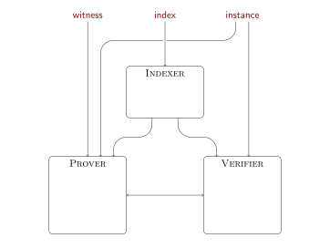

# Anatomy of a STARK, Part 6: Speeding Things Up

The previous part of this tutorial posed the question whether maths-level improvement can reduce the running times of the STARK algorithms. Indeed they can! There are folklore computational algebra tricks that are independent of the STARK machinery, as well as some techniques specific to interactive proof systems.

## The Number Theoretic Transform and its Applications

### The Fast Fourier Transform

Let $f(X)$ be a polynomial of degree at most $2^k - 1$ with complex numbers as coefficients. What is the most efficient way to find the list of evaluations $f(X)$ on the $2^k$ complex roots of unity? Specifically, let $\omega = e^{2 \pi i / 2^k}$, then the output of the algorithm should be $(f(\omega^i))_{i=0}^{2^k-1} = (f(1), f(\omega), f(\omega^2), \ldots, f(\omega^{2^k-1}))$.

The naïve solution is to sequentially compute each evaluation individually. A more intelligent solution relies on the observation that $f(\omega^i) = \sum_{j=0}^{2^k-1} \omega^{ij} f_j$ and splitting the even and odd terms gives
$$ f(\omega^i) = \sum_{j=0}^{2^{k-1}-1} \omega^{i(2j)}f_{2j} + \sum_{j=0}^{2^{k-1}-1} \omega^{i(2j+1)} f_{2j+1} \\
 = \sum_{j=0}^{2^{k-1}-1} \omega^{i(2j)}f_{2j} + \omega^i \cdot \sum_{j=0}^{2^{k-1}-1} \omega^{i(2j)} f_{2j+1} \\
 = f_E(\omega^{2i}) + \omega^i \cdot f_O(\omega^{2i}) \enspace , $$
where $f_E(X)$ and $f_O(X)$ are the polynomials whose coefficients are the even coefficients, and odd coefficients respectively, of $f(X)$.

In other words, the evaluation of $f(X)$ at $\omega^i$ can be described in terms of the evaluations of $f_E(X)$ and $f_O(X)$ at $\omega^{2i}$. The same is true for a batch of points $\lbrace\omega^{ij}\rbrace_ {j=0}^{2^k-1}$, in which case the values of $f_E(X)$ and $f_O(X)$ on a domain of only half the size are needed: $\lbrace(\omega^{ij})^2\rbrace_ {j=0}^{2^k-1} = \lbrace(\omega^{2i})^j\rbrace_ {j=0}^{2^{k-1}-1}$. Note that tasks of batch-evaluating $f_E(X)$ and $f_O(X)$ are independent tasks of half the size. This screams divide and conquer! Specifically, the following strategy suggests itself:
 - split coefficient vector into even and odd parts;
 - evaluate $f_E(X)$ on $\lbrace(\omega^{2i})^j\rbrace_{j=0}^{2^{k-1}-1}$ by recursion;
 - evaluate $f_O(X)$ on $\lbrace(\omega^{2i})^j\rbrace_{j=0}^{2^{k-1}-1}$ by recursion;
 - merge the evaluation vectors using the formula $f(\omega^i) = f_E(\omega^{2i}) + \omega^i \cdot f_O(\omega^{2i})$.

Vòilá! That's the fast Fourier transform (FFT). The reason why the $2^k$th root of unity is needed is because it guarantees that $\lbrace(\omega^{ij})^2\rbrace_ {j=0}^{2^k-1} = \lbrace(\omega^{2i})^j\rbrace_ {j=0}^{2^{k-1}-1}$, and so the recursion really is on a domain of half the size. Phrased differently, if you were to use a similar strategy to evaluate $f(X)$ in $\lbrace z^j\rbrace_{j=0}^{2^k-1}$ where $z$ is not a primitive $2^k$th root of unity then the evaluation domain would not shrink with every recursion step. There are $k$ recursion steps, and at each level there are $2^k$ multiplications and additions, so the complexity of this algorithm is $O(2^k \cdot k)$, or expressed in terms of the length of the coefficient vector $N = 2^k$, $O(N \cdot \log N)$. A lot faster than the $O(N^2)$ complexity of the naïve sequential algorithm.

Note that the only property that we need from $\omega$ is that the set of squares $\lbrace\omega^j\rbrace_{j=0}^{2^k-1}$ is a set of half the size. The number $\omega$ satisfies this property because $\omega^{2^{k-1}+i} = -\omega^i$. Importantly, $\omega$ does not need to be a complex number as long as it satisfies this property. In fact, whenever a finite field has a subgroup of order $2^k$, this subgroup is generated by some $\omega$, and this $\omega$ can be used in exactly the same way. The resulting algorithm is a finite field analogue of the FFT, sometimes called the *Number Theory Transform (NTT)*.

```python
def ntt( primitive_root, values ):
    assert(len(values) & (len(values) - 1) == 0), "cannot compute ntt of non-power-of-two sequence"
    if len(values) <= 1:
        return values

    field = values[0].field

    assert(primitive_root^len(values) == field.one()), "primitive root must be nth root of unity, where n is len(values)"
    assert(primitive_root^(len(values)//2) != field.one()), "primitive root is not primitive nth root of unity, where n is len(values)"

    half = len(values) // 2

    odds = ntt(primitive_root^2, values[1::2])
    evens = ntt(primitive_root^2, values[::2])

    return [evens[i % half] + (primitive_root^i) * odds[i % half] for i in range(len(values))]
```

The real magic comes into play when we apply the FFT (or NTT) twice, but use the inverse of $\omega$ for the second layer. Specifically, what happens if we treat the list of evaluations as a list of polynomial coefficients, and evaluate this polynomial in the $2^k$th roots of unity, in opposite order?

Recall that the $i$th coefficient of the Fourier transform is $f(\omega^i) = \sum_{j=0}^{2^k-1} f_j \omega^{ij}$. So the $l$th coefficient of the double Fourier transform is
$$ \sum_{i=0}^{2^k-1} f(\omega^i) \omega^{-il} = \sum_{i=0}^{2^k-1} \left( \sum_{j=0}^{2^k-1} f_j \omega^{ij} \right) \omega^{-il} \\
= \sum_{j=0}^{2^k-1} f_j \sum_{i=0}^{2^k-1} \omega^{i(l-j)} \enspace .$$

Whenever $l-j \neq 0$, the sum $\sum_{i=0}^{2^k-1} \omega^{i(l+j)}$ vanishes. To see this, recall that $\omega^{2^{k-1} + i} = -\omega^i$ for all $i$, so every term in this sum has an equal and opposite term that cancels it. So in the formula above, the only coefficient $f_j$ that is multiplied by a nonzero sum is $f_{l}$, and in fact this sum is $\sum_{i=0}^{1}1 = 2^k$. So in summary, the $l$th coefficient of the double Fourier transform of $\mathbf{f}$ is $2^k \cdot f_{l}$, which is the same as the $l$th coefficient of $\mathbf{f}$ but scaled by a factor $2^k$.

What was derived was an inverse fast Fourier transform. Specifically, this inverse is the same as the regular fast Fourier transform, except
 - it uses $\omega^{-1}$ instead of $\omega$; and
 - it needs to undo the scaling factor $2^k$ on every coefficient.

Once again, the logic applies to finite fields that are equipped with a subgroup of order $2^k$ without any change, resulting in the inverse NTT.

```python
def intt( primitive_root, values ):
    assert(len(values) & (len(values) - 1) == 0), "cannot compute intt of non-power-of-two sequence"

    if len(values) == 1:
        return values

    field = values[0].field
    ninv = FieldElement(len(values), field).inverse()

    transformed_values = ntt(primitive_root.inverse(), values)
    return [ninv*tv for tv in transformed_values]
```

### Fast Polynomial Arithmetic

The NTT is popular in computer algebra because the Fourier transform induces a homomorphism for polynomials and their values. Specifically, multiplication of polynomials corresponds to element-wise multiplication of their Fourier transforms. To see this, apply the formula for the Fourier transform to the formula for the product polynomial. To see why this is true, remember that the Fourier transform represents the *evaluations* of a polynomial. Clearly, the evaluation of $h(X) = f(X) \cdot g(X)$ in any point $z$ is the product of the evaluations of $f(X)$ and $g(X)$ in $z$. As long as $\mathsf{deg}(h(X)) < 2^k$, we can compute this product by:
 - computing the NTT; 
 - miltiplying the resulting vectors element-wise; and
 - computing the inverse NTT.

```python
def fast_multiply( lhs, rhs, primitive_root, root_order ):
    assert(primitive_root^root_order == primitive_root.field.one()), "supplied root does not have supplied order"
    assert(primitive_root^(root_order//2) != primitive_root.field.one()), "supplied root is not primitive root of supplied order"

    if lhs.is_zero() or rhs.is_zero():
        return Polynomial([])

    field = lhs.coefficients[0].field
    root = primitive_root
    order = root_order
    degree = lhs.degree() + rhs.degree()

    if degree < 8:
        return lhs * rhs

    while degree < order // 2:
        root = root^2
        order = order // 2

    lhs_coefficients = lhs.coefficients[:(lhs.degree()+1)]
    while len(lhs_coefficients) < order:
        lhs_coefficients += [field.zero()]
    rhs_coefficients = rhs.coefficients[:(rhs.degree()+1)]
    while len(rhs_coefficients) < order:
        rhs_coefficients += [field.zero()]

    lhs_codeword = ntt(root, lhs_coefficients)
    rhs_codeword = ntt(root, rhs_coefficients)

    hadamard_product = [l * r for (l, r) in zip(lhs_codeword, rhs_codeword)]

    product_coefficients = intt(root, hadamard_product)
    return Polynomial(product_coefficients[0:(degree+1)])
```

Fast multiplication serves as the basis for a bunch of fast polynomial arithmetic algorithms. Of particular interest to this tutorial is the calculation of *zerofiers* -- the polynomials that vanish on a given list of points called the *domain*. For this task, the divide-and-conquer strategy suggests itself:
 - divide the domain into two equal parts;
 - compute the zerofiers for the two parts separately; and
 - multiply the zerofiers using fast multiplication.

```python
def fast_zerofier( domain, primitive_root, root_order ):
    assert(primitive_root^root_order == primitive_root.field.one()), "supplied root does not have supplied order"
    assert(primitive_root^(root_order//2) != primitive_root.field.one()), "supplied root is not primitive root of supplied order"

    if len(domain) == 0:
        return Polynomial([])

    if len(domain) == 1:
        return Polynomial([-domain[0], primitive_root.field.one()])

    half = len(domain) // 2

    left = fast_zerofier(domain[:half], primitive_root, root_order)
    right = fast_zerofier(domain[half:], primitive_root, root_order)
    return fast_multiply(left, right, primitive_root, root_order)
```

Another task benefiting from fast multiplication (not to mention fast zerofier calculation) is batch evaluation in an arbitrary domain. The idea behind the algorithm is to progressively reduce the given polynomial to a new polynomial that takes the same values on a subset of the domain. The term "reduce" is not a metaphor -- it is polynomial reduction modulo the zerofier for that domain. So this gives rise to another divide-and-conquer algorithm:
 - divide the domain into two halves, left and right;
 - compute the zerofier for each half;
 - reduce the polynomial modulo left zerofier and modulo right zerofier;
 - batch-evaluate left remainder in left domain half and right remainder in right domain;
 - concatenate vectors of evaluation.

Note that the zerofiers, which are calculated by another divide-and-conquer algorithm, are used in the opposite order to how they are produced. A slightly more complex algorithm makes use of memoization for a performance boost.

```python
def fast_evaluate( polynomial, domain, primitive_root, root_order ):
    assert(primitive_root^root_order == primitive_root.field.one()), "supplied root does not have supplied order"
    assert(primitive_root^(root_order//2) != primitive_root.field.one()), "supplied root is not primitive root of supplied order"

    if len(domain) == 0:
        return []

    if len(domain) == 1:
        return [polynomial.evaluate(domain[0])]

    half = len(domain) // 2

    left_zerofier = fast_zerofier(domain[:half], primitive_root, root_order)
    right_zerofier = fast_zerofier(domain[half:], primitive_root, root_order)

    left = fast_evaluate(polynomial % left_zerofier, domain[:half], primitive_root, root_order)
    right = fast_evaluate(polynomial % right_zerofier, domain[half:], primitive_root, root_order)

    return left + right
```

Let's now turn to the opposite of evaluation -- polynomial interpolation. Ideally, we would like to apply another divide-and-conquer strategy, but it's tricky. We can divide the set of points into two halves and find the interpolants for each, but then how do we combine them?

How about finding the polynomial that passes through the left half of points, and takes the value 0 in the x-coordinates of the right half, and vice versa? This is certainly progress because adding them will give the desired interpolant. However, this is no longer a divide-and-conquer algorithm because after one recursion step the magnitude of the problem is still the same.

What if we find the interpolant through the left half of points, and multiply it by the zerofier of right half's x-coordinates? Close, but no cigar: the zerofier will take values different from 1 on the left x-coordinates, meaning that multiplication will destroy the information embedded in the left interpolant.

But the right zerofier's values in the left x-coordinates are not random, and can be predicted simply by calculating the right zerofier and batch-evaluating it in the left x-coordinates. What needs to be done is to find the polynomial that passes through points whose x-coordinates correspond to the left half of points, and whose y-coordinates anticipate multiplication by the zerofier. These are just the left y-coordinates, divided by values of the right zerofier in the matching x-coordinates.

```python
def fast_interpolate( domain, values, primitive_root, root_order ):
    assert(primitive_root^root_order == primitive_root.field.one()), "supplied root does not have supplied order"
    assert(primitive_root^(root_order//2) != primitive_root.field.one()), "supplied root is not primitive root of supplied order"
    assert(len(domain) == len(values)), "cannot interpolate over domain of different length than values list"

    if len(domain) == 0:
        return Polynomial([])

    if len(domain) == 1:
        return Polynomial([values[0]])

    half = len(domain) // 2

    left_zerofier = fast_zerofier(domain[:half], primitive_root, root_order)
    right_zerofier = fast_zerofier(domain[half:], primitive_root, root_order)

    left_offset = fast_evaluate(right_zerofier, domain[:half], primitive_root, root_order)
    right_offset = fast_evaluate(left_zerofier, domain[half:], primitive_root, root_order)

    if not all(not v.is_zero() for v in left_offset):
        print("left_offset:", " ".join(str(v) for v in left_offset))

    left_targets = [n / d for (n,d) in zip(values[:half], left_offset)]
    right_targets = [n / d for (n,d) in zip(values[half:], right_offset)]

    left_interpolant = fast_interpolate(domain[:half], left_targets, primitive_root, root_order)
    right_interpolant = fast_interpolate(domain[half:], right_targets, primitive_root, root_order)

    return left_interpolant * right_zerofier + right_interpolant * left_zerofier
```

Next up: fast evaluation on a coset. This task is needed in the STARK pipeline when transforming a polynomial into a codeword to be input to FRI. It is possible to solve this problem using fast batch-evaluation on arbitrary domains. However, when the given domain coincides with a coset of order $2^k$, it would be a shame not to use the NTT directly. The only question is how to shift the domain of evaluation. This is precisely what polynomial scaling achieves.

```python
def fast_coset_evaluate( polynomial, offset, generator, order ):
    scaled_polynomial = polynomial.scale(offset)
    values = ntt(generator, scaled_polynomial.coefficients + [offset.field.zero()] * (order - len(polynomial.coefficients)))
    return values
```

Fast evaluation on a coset allows us to answer a pesky problem that arises when adapting the fast multiplication procedure to divide instead of multiply. Where fast multiplication used element-wise multiplication on codewords, fast division uses element-wise division on codewords, where the codewords are obtained by applying the NTT to the polynomials' coefficient vectors. The problem is this: what happens when the divisor codeword is zero in a given location? If the numerator codeword is not zero in that location, then the division is unclean and has a nonzero remainder. In this case the entire operation can be flagged as erroneous. However, there can still be clean division if the numerator is also zero in the given location. The naïve fast division algorithm fails because of a zero-divided-by-zero error, even though the underlying polynomials generate a clean division. This is exactly the problem that occurs when attempting to use NTTs to divide out the zerofiers. We got around this problem in the previous part of the tutorial by using polynomial long division instead, but this solution has a *quadratic* running time. We want quasilinear!

The solution is to perform the element-wise division on codewords arising from evaluation on a coset of the group over which the NTT is defined. Specifically, the procedure involves five steps:
 - scale
 - NTT
 - element-wise divide
 - inverse NTT
 - unscale

This solution only works if the denominator polynomials does not have any zeros on the coset. However, in some cases (like dividing out zerofiers), the denominator is *known* not to have zeros on a partcular coset.

The python code has a lot of boilerplate to deal with special circumstances, but in the end it boils down to those five steps.

```python
def fast_coset_divide( lhs, rhs, offset, primitive_root, root_order ): # clean division only!
    assert(primitive_root^root_order == primitive_root.field.one()), "supplied root does not have supplied order"
    assert(primitive_root^(root_order//2) != primitive_root.field.one()), "supplied root is not primitive root of supplied order"
    assert(not rhs.is_zero()), "cannot divide by zero polynomial"

    if lhs.is_zero():
        return Polynomial([])

    assert(rhs.degree() <= lhs.degree()), "cannot divide by polynomial of larger degree"

    field = lhs.coefficients[0].field
    root = primitive_root
    order = root_order
    degree = max(lhs.degree(),rhs.degree())

    if degree < 8:
        return lhs / rhs

    while degree < order // 2:
        root = root^2
        order = order // 2

    scaled_lhs = lhs.scale(offset)
    scaled_rhs = rhs.scale(offset)
    
    lhs_coefficients = scaled_lhs.coefficients[:(lhs.degree()+1)]
    while len(lhs_coefficients) < order:
        lhs_coefficients += [field.zero()]
    rhs_coefficients = scaled_rhs.coefficients[:(rhs.degree()+1)]
    while len(rhs_coefficients) < order:
        rhs_coefficients += [field.zero()]

    lhs_codeword = ntt(root, lhs_coefficients)
    rhs_codeword = ntt(root, rhs_coefficients)

    quotient_codeword = [l / r for (l, r) in zip(lhs_codeword, rhs_codeword)]
    scaled_quotient_coefficients = intt(root, quotient_codeword)
    scaled_quotient = Polynomial(scaled_quotient_coefficients[:(lhs.degree() - rhs.degree() + 1)])

    return scaled_quotient.scale(offset.inverse())

```

## Fast Zerofier Evaluation

The algorithms described above chiefly apply to the prover, whose complexity drops from $O(T^2)$ to $O(T \log T)$. Scalability for the prover is achieved. The verifier's bottleneck is the evaluation of the transition zerofier, which is in general a dense polynomial of degree $T$. As a result, roughly $T$ coefficients will be possibly nonzero, and since the verifier must touch all of them to compute the polynomial's value, his running time will be on the same order of magnitude. For scalable verifiers, we need a running time of at most $\tilde{O}(\log T)$. There are two strategies to achieve this: sparse zerofiers based on group theory, and preprocessed dense zerofiers.

## Sparse Zerofiers with Group Theory

It is an elementary fact of group theory that every element raised to its order gives the identity. For example, an element $x$ of the subgroup of order $r$ of the multiplicative group of a finite field $\mathbb{F}_ p \backslash \lbrace 0 \rbrace$ satisfies $x^r = 1$. Rearranging, and replacing $x$ with a formal indeterminate $X$, we get a polynomial
$$ X^r - 1 $$
that is guaranteed to evaluate to zero in every element of the order-$r$ subgroup. Furthermore, this polynomial is monic (*i.e.*, the leading coefficient is one) and of minimal degree (across all polynomials that vanish on all $r$ points of the subgroup). Therefore, this sparse polynomial is exactly the zerofier for the subgroup!

For STARKs, we are already using finite fields that come with subgroups of order $2^k$ for many $k$. Therefore, if the execution trace is interpolated over $\lbrace \omicron^i \, \vert \, 0 \leq i < 2^k \rbrace$ where $\omicron$ is a generator of the subgroup of order $2^k$, then the zerofier for $\lbrace \omicron^i \, \vert \, 0 \leq i < 2^k - 1\rbrace$ is equal to the rational expression
$$ \frac{X^{2^k-1} - 1}{X - \omicron^{-1}} $$
in all points $X$ except for $X = \omicron^{-1}$, where the rational expression is undefined.

The verifier obviously does not perform the division because it turns a dense polynomial into a sparse one. Instead, the verifier evaluates the numerator sparsely and divides it by the value of the denominator. This works as long as the verifier does not need to evaluate the zerofier in $\omicron^{-1}$, which is precisely what the coset-trick of FRI guarantees.

To apply this strategy, the STARK trace length must be a power of 2. If the trace is far from a power of two, say by a difference of $d$, then the verifier needs to evaluate a zerofier that has $d-1$ factors in the denominator. In other words, *the trace length must be a power of two in order for the verifier to be fast*.

The solution is to pad the trace until its length is the next power of 2. Clearly this padding must be compatible with the transition constraints so that the composition polynomials still evaluate to zero on all (but one point) of the power-of-two subgroup. The natural solution is to apply the same transition function for a power of two number of cycles, and have the boundary conditions refer to the "output" whose cycle index is somewhere in the middle. However, this design decision introduces a problem when it comes to appending randomizers to the trace for the purpose of leaking zero knowledge.
 - If the randomizers are appended after padding the trace, then the randomized trace does not fit into the power-of-two subgroup. In this case the interpolant must be computed such that:
   - over the power-of-two subgroup it evaluates to the execution trace; and
   - over a distinct domain it evaluates to the uniformly random randomizers.
 - If the randomizers are appended before padding, then the transition constraints must by compatible with this operation, or else the composition polynomials will not evaluate to zero in the entire power-of-two subgroup. This option requires changing the AIR.

### Preprocessing

Where a standard Polynomial IOP consists of two parties, the prover and the verifier, a *Preprocessing Polynomial IOP* consists if three: a prover, a verifier, and an *indexer*. (The indexer is sometimes also called the *preprocessor* or the *helper*.)

The role of the indexer is to perform computations that help the verifier (not to mention prover) but that are too expensive for the verifier to perform directly. The catch is that the indexer does not receive the same input as the verifier does. The indexer's input (the *index*) is information about the computation that can be computed ahead of time, before specific data is known. For example, the index could be the number of cycles that the computation is supposed to take, along with the transition constraints. The specific information about the computation, or *instance*, would be the boundary constraints. The verifier's input is the instance as well as the indexer's output (which itself may include the index). The point is that from the verifier's point of view, the indexer's output is trusted.



The formal definition of STARKs does not capture proof systems with preprocessing, and when counting the indexer's work as verifier work, a proof system with preprocessing is arguably not scalable. Nevertheless, a preprocessing proof system can be scalable in the English sense of the word if the verifier's work (not counting that of the indexer) is polylogarithmic in the size of the computation.

### Preprocessed Dense Zerofiers

Concretely, the indexer's output to the verifier will be a commitment to the zerofier $Z(X) = \prod_{i=0}^{T-1} (X-\omicron^i)$ via the familiar Merkle root of Reed-Solomon codeword construction. Whenever the verifier needs the value of this zerofier in a point, the prover provides him with this leaf along with an authentication path. Note that the verifier does not need evaluate the zerofier in points outside the FRI domain. As a result, there is no need to prove that the zerofier has a low degree; it comes straight from the trusted indexer.

This description highlights the main drawback of using preprocessing to achieve scalability: the proof is larger because it includes more Merkle authentication paths. Another drawback is the slightly stronger security model: the verifier needs to trust the indexer's output. Even though the preprocessing is transparent here, re-running the indexer in order to justify this trust might be prohibitively expensive. The code supporting this tutorial achieves scalability through preprocessing as opposed to group theory.

### Variable Execution Times

The solution described above works perfectly fine if the execution time $T$ is known beforehand. What to do, however, when the execution time is not known beforehand, and thus cannot be included in the index?

Preprocessing still holds a solution, but at the cost of a slightly more expensive verifier. The indexer commits to each member of a family of zerofiers $\{Z_ {2^k}(X)\}_ k$ where $Z_{2^k}(X) = \prod_{i=0}^{2^k-1} (X - \omicron^i)$. Let $t = \lfloor \log_2 T \rfloor$ such that $Z_{2^t}(X)$ belongs to this family.

The prover wishes to show that a certain transition polynomial $p(X)$ evaluates to zero on $\{\omicron^i\}_ {i=0}^{T-1}$. Without preprocessing, he would commit to and prove the bounded degree of a quotient polynomial $q(X) = p(X) / Z_{T-1}(X)$, where $Z_{T-1}(X) = \prod_{i=0}^{T-1} (X - \omicron^i)$. With preprocessing, he must commit to and prove the bounded degree of two quotient polynomials:
 1. $q_l(X) = \frac{p(X) }{ Z_{2^t}(X)}$ and
 2. $q_r(X) = \frac{p(X) }{\omicron^{T-1-2^t} \cdot Z_{2^t}(\omicron^{2^t-T+1} \cdot X)}$.

The denominator of the second polynomial is exactly the zerofier $\prod_{i=T-1-2^t}^{T-1} (X - \omicron^i)$. The transition polynomial is divisible by both zerofiers if and only if it is divisible by the union zerofier $\prod_{i=0}^{T-1} (X - \omicron^i)$.

While this solution works adequately in the general case, for the Rescue-Prime computation, the cycle count is known. Therefore, the implementation reflects this setting.

## Fast STARKs

Now it is time to apply the developed tools to make the STARK algorithmically efficient.

First, add a preprocessing function. This function is a member of the STARK class with access to its fields (such as the number of cycles). It produces two outputs: one for the prover, and one for the verifier. In this concrete case, the prover receives the zerofier polynomial and zerofier codeword, and the verifier receives the zerofier Merkle root.

```python
# class FastStark:
# [...]
    def preprocess( self ):
        transition_zerofier = fast_zerofier(self.omicron_domain[:(self.original_trace_length-1)], self.omicron, len(self.omicron_domain))
        transition_zerofier_codeword = fast_coset_evaluate(transition_zerofier, self.generator, self.omega, self.fri.domain_length)
        transition_zerofier_root = Merkle.commit(transition_zerofier_codeword)
        return transition_zerofier, transition_zerofier_codeword, transition_zerofier_root
```

The argument lists of `prove` and `verify` must be adapted accordingly.

```python
# class FastStark:
# [...]
    def prove( self, trace, transition_constraints, boundary, transition_zerofier, transition_zerofier_codeword, proof_stream=None ):
# [...]
    def verify( self, proof, transition_constraints, boundary, transition_zerofier_root, proof_stream=None ):
```

The prover can use fast coset division to divide out the transition zerofier, and note that this denominator is exactly the argument.

```python
# class FastStark:
#     [...]
#     def prove( [..] ):
#       [...]
        # divide out zerofier
        transition_quotients = [fast_coset_divide(tp, transition_zerofier, self.generator, self.omicron, self.omicron_domain_length) for tp in transition_polynomials]
```

The verifier needs to perform this division in a number of locations, which means that he needs the value of the verifier in those locations. Therefore, the prover must provide them, which authentication paths.

```python
# class FastStark:
#     [...]
#     def prove( [..] ):
#       [...]
        # ... and also in the zerofier!
        for i in quadrupled_indices:
            proof_stream.push(transition_zerofier_codeword[i])
            path = Merkle.open(i, transition_zerofier_codeword)
            proof_stream.push(path)
```

The verifier, in turn, needs to read these values and their authentication paths from the proof stream, before verifying the authentication paths and storing the zerofier values in a structure for later use. Note that these authentication paths are verified against the Merkle root, which is the new input to the verifier.

```python
# class FastStark:
#     [...]
#     def verify( [..] ):
#       [...]
        # read and verify transition zerofier leafs
        transition_zerofier = dict()
        for i in duplicated_indices:
            transition_zerofier[i] = proof_stream.pull()
            path = proof_stream.pull()
            verifier_accepts = verifier_accepts and Merkle.verify(transition_zerofier_root, i, path, transition_zerofier[i])
            if not verifier_accepts:
                return False
```

Then finally, when the nonlinear combination is computed, can these values be read from memory and used.

```python
# class FastStark:
#     [...]
#     def verify( [..] ):
#       [...]
                quotient = tcv / transition_zerofier[current_index]
```

At this point what is left is switching to fast polynomial arithmetic outside of the context of preprocessing. The first opportunity is interpolating the trace.

```python
# class FastStark:
#     [...]
#     def prove( [..] ):
#         [...]
            trace_polynomials = trace_polynomials + [fast_interpolate(trace_domain, single_trace, self.omicron, self.omicron_domain_length)]
```

Next: when committing to the boundary quotients, use fast coset evaluation. Same goes for the randomizer polynomial as well as the combination polynomial.

```python
# class FastStark:
#     [...]
#     def prove( [..] ):
        # [...]
        # commit to boundary quotients
        # [...]
        for s in range(self.num_registers):
            boundary_quotient_codewords = boundary_quotient_codewords + [fast_coset_evaluate(boundary_quotients[s], self.generator, self.omega, self.fri_domain_length)]
            merkle_root = Merkle.commit(boundary_quotient_codewords[s])
            proof_stream.push(merkle_root)
        # [...]
        # commit to randomizer polynomial
        randomizer_polynomial = Polynomial([self.field.sample(os.urandom(17)) for i in range(self.max_degree(transition_constraints)+1)])
        randomizer_codeword = fast_coset_evaluate(randomizer_polynomial, self.generator, self.omega, self.fri_domain_length)
        randomizer_root = Merkle.commit(randomizer_codeword)
        proof_stream.push(randomizer_root)
        # [...]
        # compute matching codeword
        combined_codeword = fast_coset_evaluate(combination, self.generator, self.omega, self.fri_domain_length)
```

Dividing out the transition zerofier is a pretty intense task. It pays to switch to NTT-based division. Note that coset division is needed here, since the zerofier definitely takes the value zero on points of the trace domain.

```python
        # divide out zerofier
        transition_quotients = [fast_coset_divide(tp, transition_zerofier, self.generator, self.omicron, self.omicron_domain_length) for tp in transition_polynomials]
```

Lastly, in the FRI verifier, switch out the slow Lagrange interpolation for the much faster (coset) NTT based interpolation.

```python
# class Fri:
    # [...]
    # def verify( [..] ):
        # [...]
        # compute interpolant
        last_domain = [last_offset * (last_omega^i) for i in range(len(last_codeword))]
        coefficients = intt(last_omega, last_codeword)
        poly = Polynomial(coefficients).scale(last_offset.inverse())
```

After modifying the Rescue-Prime signature scheme to use the new, `FastStark` class and methods, this gives rise to a significantly faster signature scheme.

 - secret key size: 16 bytes (yay!)
 - public key size: 16 bytes (yay!)
 - signature size: **~160 kB**
 - keygen time: 0.01 seconds (acceptable)
 - signing time: **72 seconds**
 - verification time: **8 seconds**

How's that for an improvement? The proof is larger because there are many more Merkle paths associated with zerofier leafs, but in exchange verifying is an order of magnitude faster. Of course there is no shortage of further improvements, but those are beyond the scope of this tutorial and left as exercises to the reader.


[0](index) - [1](overview) - [2](basic-tools) - [3](fri) - [4](stark) - [5](rescue-prime) - **6**
