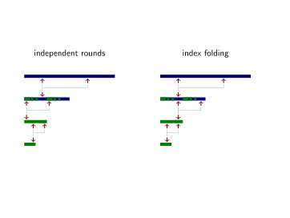

# Anatomy of a STARK, Part 3: FRI

FRI is a protocol that establishes that a committed polynomial has a bounded degree. The acronym FRI stands for *Fast Reed-Solomon IOP of Proximity*, where IOP stands for *interactive oracle proof*. FRI is presented in the language of codewords: the prover sends codewords to the verifier who does not read them whole but who makes oracle-queries to read them in select locations. The codewords in this protocol are *Reed-Solomon codewords*, meaning that their values correspond to the evaluation of some low-degree polynomial in a list of points called the domain $D$. The length of this list is larger than the number of possibly nonzero coefficients in the polynomial by a factor called the *expansion factor* (also *blowup factor*), which is the reciprocal of the code's *rate* $\rho$.

Since the codewords represent low-degree polynomials, and since the codewords are hidden behind Merkle trees in any real-world deployment, it is arguably more natural to present FRI from the point of view of a polynomial commitment scheme, with some caveats. There is scientific merit in separating the type of codewords from the IOP, and those two from the Merkle tree that simulates the oracles. However, from an accessibility point of view, it is beneficial to consider them as three components of one basic primitive that relates to polynomial commitment schemes. For the remainder of this tutorial, we will use the term FRI in this sense.

In a regular polynomial commitment scheme, a prover commits to a polynomial $f(X)$ that is later opens in a given point $z$ such that it cannot equivocate between two different values of $f(z)$. The scheme consists of three algorithms:
 - $\mathsf{commit}$, which computes a binding commitment from the polynomial;
 - $\mathsf{open}$, which produces a proof that $f(z) = y$ for some $z$ and for the polynomial $f(X)$ that matches with the given commitment;
 - $\mathsf{verify}$, which verifies the proof produced by $\mathsf{open}$.

The FRI scheme has a different interface but a later section shows how it can simulate the standard polynomial commitment scheme interface without much overhead. FRI is a protocol between a prover and a verifier, which establishes that a given codeword belongs to a polynomial of low degree -- low meaning at most $\rho$ times the length of the codeword. Without losing much generality[^1], the prover knows this codeword explicitly, whereas the verifier knows only its Merkle root and leafs of his choosing, assuming the successful validation of the authentication paths that establish the leafs' membership to the Merkle tree.

## Split-and-Fold

One of the great ideas for proof systems in recent years was *split-and-fold* technique. The idea is to reduce a claim to two claims of half the size. Then both claims are merged into one using random weights supplied by the verifier. After logarithmically many steps (as a function of the size of the original claim) the claim has been reduced to one of a trivial size which is true if and only if (modulo some negligible security degradation) the original claim was true.

In the case of FRI, this computational claim asserts that the given codeword corresponds to a polynomial of low degree. Specifically, let $N$ be the length of the codeword, and $d$ be the maximum degree of the polynomial that it corresponds[^2] to. Let this polynomial be $f(X) = \sum_{i=0}^{d} c_i X^i$.

Following the divide-and-conquer strategy of the fast Fourier transform, this polynomial is divided into even and odd terms.
$$ f(X) = f_E(X^2) + X \cdot f_O(X^2) $$
where
$$ f_E(X^2) = \frac{f(X) + f(-X)}{2} = \sum_{i=0}^{\frac{d+1}{2}-1} c_{2i} X^{2i} $$
and
$$f_O(X^2) = \frac{f(X) - f(-X)}{2X} = \sum_{i=0}^{\frac{d+1}{2}-1} c_{2i+1} X^{2i} \enspace .$$
To see that this decomposition is correct, observe that for $f_E(X)$, the odd terms cancel; whereas for $f_O(X)$, it is the even terms that cancel. The key step of the protocol derives a codeword for $f^\star(X) = f_E(X) + \alpha \cdot f_O(X)$ from the codeword for $f(X)$, where $\alpha$ is a random scalar supplied by the verifier.

Let $D$ be a subgroup of even order $N$ of the multiplicative group of the field, and let $\omega$ generate this subgroup: $\langle \omega \rangle = D \subset \mathbb{F}_p \backslash\lbrace 0\rbrace.$

Let $\lbrace f(\omega^i)\rbrace_{i=0}^{N-1}$ be the codeword for $f(X)$, corresponding with evaluation on $D$. Let $D^\star = \langle \omega^2 \rangle$ be another domain, of half the length, and $\lbrace f_ E(\omega^{2i})\rbrace_{i=0}^{N/2-1}$, $\lbrace f_ O(\omega^{2i})\rbrace_{i=0}^{N/2-1}$, and $\lbrace f^\star(\omega^{2i})\rbrace_ {i=0}^{N/2-1}$ be the codewords for $f_E(X)$, $f_O(X)$, and $f^\star(X)$, respectively, corresponding to evaluation on $D^\star$.

Expanding the definition of $f^\star(X)$ gives
$$ \lbrace f^\star(\omega^{2i})\rbrace_{i=0}^{N/2-1} = \lbrace f_E(\omega^{2i}) + \alpha \cdot f_O(\omega^{2i})\rbrace_{i=0}^{N/2-1} . $$


Expand again, this time with the definition of $f_E(X^2)$ and $f_O(X^2)$.

$$ \lbrace f^\star(\omega^{2i})\rbrace_{i=0}^{N/2-1} $$
$$ = \left\lbrace  \frac{f(\omega^i) + f(-\omega^i)}{2} + \alpha \cdot \frac{f(\omega^i) - f(-\omega^i)}{2 \omega^i} \right\rbrace_{i=0}^{N/2-1} $$
$$ = \lbrace  2^{-1} \cdot \left( ( 1 + \alpha \cdot \omega^{-i} ) \cdot f(\omega^i) + (1 - \alpha \cdot \omega^{-i} ) \cdot f(-\omega^i) \right) \rbrace_{i=0}^{N/2-1} $$

Since the order of $\omega$ is $N$, we have $\omega^{N/2} = -1$, and therefore $f(-\omega^i) = f(\omega^{N/2 + i})$. This substitution makes it clear that even though the index iterates over half the range (from $0$ to $N/2-1$), all the points of $\lbrace f(\omega^i)\rbrace_{i=0}^{N-1}$

are involved in the derivation of $\lbrace f^\star(\omega^{2i})\rbrace_{i=0}^{N/2-1}$. It does not matter that the latter codeword has half the length; its polynomial has half the degree.

At this point it is possible to describe the mechanics for one round of the FRI protocol. The prover commits to $f(X)$ by sending the Merkle root of its codeword to the verifier. The verifier responds with the random challenge $\alpha$. The prover computes $f^\star(X)$ and commits to it by sending the Merkle root of $\lbrace f^\star(\omega^{2i})\rbrace_{i=0}^{N/2-1}$ to the verifier.

The verifier now has two commitments to polynomials and his task is to verify that their correct relation holds. Specifically, the verifier should reject the proof if $f^\star(X) \neq 2^{-1} \cdot \left( (1 + \alpha X^{-1}) \cdot f(X) + (1 - \alpha X^{-1} ) \cdot f(-X) \right)$. (Ignore the values left and right hand sides take in 0.) To do this, the verifier randomly samples an index $i \xleftarrow{\$} \lbrace 0, \ldots, N/2-1\rbrace$, which defines 3 points:
 - $A: (\omega^i, f(\omega^i))$,
 - $B: (\omega^{N/2+i}, f(\omega^{N/2+i}))$,
 - $C: (\alpha, f^\star(\omega^{2i}))$.

Notice that the x-coordinates of $A$ and $B$ are the square roots of $\omega^{2i}$. Upon receiving the index $i$ from the verifier, the prover provides the y-coordinates along with their Merkle authentication paths. The verifier verifies these paths against their proper roots and follows up by verifying that $A$, $B$, and $C$ fall on a straight line. This test is known as the *colinearity check*.

Why would $A$, $B$, and $C$ lie on a straight line? Let's find the line that passes through $A$ and $B$ and see what that means for $C$. An elementary Lagrange interpolation yields
$$ y = \sum_i y_i \prod_{j \neq i} \frac{x - x_j}{x_i - x_j} \\
= f(\omega^i) \cdot \frac{x - \omega^{N/2+i}}{\omega^{i} - \omega^{N/2+i}} + f(\omega^{N/2+i}) \cdot \frac{x - \omega^{i}}{\omega^{N/2+i} - \omega^{i}} \\
=  f(\omega^i) \cdot 2^{-1} \cdot \omega^{-i} \cdot (x + \omega^i) - f(\omega^{N/2+i}) \cdot 2^{-1} \cdot \omega^{-i} (x - \omega^i) \\
= 2^{-1} \cdot \left( (1 + x \cdot \omega^{-i}) \cdot f(\omega^i) + (1 - x \cdot \omega^i) \cdot f(\omega^{N/2 + i}) \right) \enspace .$$
By setting $x = \alpha$ we get exactly the y-coordinate of $C$.

This description covers one round, at the end of which the prover and verifier are in the same position as they were at the start. The prover wishes to establish that a given Merkle root decommits to a codeword whose defining polynomial has a bounded degree. There is one important difference though: as a result of running one round of FRI, the length of the codeword as well as the number of possibly nonzero coefficients of the polynomial have halved. Prover and verifier can set $f = f^\star$, $D = d^\star$, and repeat the process. After running $\lceil \log_2 (d+1) \rceil - 1$ rounds of FRI, where $d$ is the degree of the original polynomial, prover and verifier end up with a constant polynomial whose codeword is also constant. At this point, the prover sends this constant[^3] instead of the codeword's Merkle root, making it abundantly clear that it corresponds to a polynomial of degree $0$.


In production systems the length of the codeword is often reduced not by a factor 2 but a small power of 2. This optimization reduces the proof size and might even generate running time improvements. However, this tutorial optimizes for simplicity and any further discussion about higher folding factors is out of scope.

### Index Folding

The above description glosses over a counter-intuitive but highly subtle point: *the random indices are not independent between rounds*. Instead, the same index is re-used across all rounds, with reductions modulo the codeword length when necessary.

The reason why sampling the indices independently in each round is less secure, is because it is likely to fail to catch hybrid codewords, as the next picture shows.



The blue codeword is far from any codeword that matches with a low degree polynomial, whereas the green codeword does correspond to a low degree polynomial. In order to switch from blue to green, the malicious prover uses a hybrid codeword in the second round. This hybrid codeword is obtained by selecting the values from the one codeword or the other based on a randomly chosen partition. The malicious prover succeeds when all colinearity checks involve points of the same color.

The attack is thwarted when the same indices are used. The hybrid codeword necessarily generates a colinearity test of mismatching colors -- either in the current or in the next round.

### Intuition for Security

The polynomial $f^\star(X^2)$ is a random linear combination of $f(X)$ and $f(-X)$. Clearly, if the prover is honest, then $f^\star(X)$ and its codeword satisfy this relation. What is less intuitive is when the prover is dishonest in more subtle ways than the hybrid codeword attack -- what is it about this colinearity check that makes the verifier likely to notice the fraud?

A fraudulent prover is successful when the verifier accepts a codeword that does not correspond to a low degree polynomial. Let $\lbrace f(\omega^i)\rbrace_{i=0}^{N-1}$ be such a fraudulent codeword, corresponding to a polynomial $f(X)$ of degree $N-1$. Then $f_E(X)$ and $f_O(X)$ will be of degree at most $N/2 - 1$, and so will their linear combination $f^\star(X) = f_E(X) + \alpha \cdot f_O(X)$. At this point the malicious prover has two options.
 1. He computes the codeword $\lbrace f^\star(\omega^{2i})\rbrace_{i=0}^{N/2-1}$ honestly by evaluating $f^\star(X)$ on $L^\star = \langle \omega^2 \rangle$. This does not improve his situation because instead of "proving" that a codeword of length $N$ corresponds to a polynomial of degree less than $\rho \cdot N$, he now has to "prove" that this codeword of length $N/2$ corresponds to a polynomial of degree less than $\rho \cdot N/2$. There is no reason to assume this false claim is any easier to prove than the one he started out with.
 2. He sends a different codeword $\lbrace v_i\rbrace_{i=0}^{N/2-1}$ that disagrees with $f^\star(X)$ in *enough* points of $L^\star = \langle \omega^2 \rangle$. This is exactly the type of fraud that is likely to be exposed by the verifier's colinearity checks.

Intuitively, a prover who lies in one location is hardly cheating, because it is a single error in an error-correcting code. The other $N/2-1$ values of the codeword still uniquely identify the codeword's defining polynomial. A cheating prover needs the fraudulent codeword $\lbrace v_i\rbrace_{i=0}^{N/2-1}$ to correspond to a polynomial of degree less than $\rho \cdot N/2$, and for that to be the case it needs to agree with this low degree polynomial in many more points than just one. But as the number of points where the malicious prover is being dishonest increases, so too does the probability of this fraud being exposed by the colinearity check.

### Security Level

How many colinearity checks are needed for a target security level of $\lambda$ bits? That's the million dollar question.

The [FRI paper](https://eccc.weizmann.ac.il/report/2017/134/revision/1/download/), the [DEEP-FRI follow-up](https://sites.math.rutgers.edu/~sk1233/deep-fri.pdf), and the [follow-up to the follow-up](https://eprint.iacr.org/2020/654), present a sequence of more refined argument relying crucially on the code rate $\rho$. I do not pretend to understand these proofs and will content myself with merely reciting the rule of thumb used in the [EthSTARK documentation](https://eprint.iacr.org/2021/582) for conjectural security[^4]:
 - The hash function used for building Merkle trees needs to have at least $2\lambda$ output bits.
 - The field needs to have at least $2^\lambda$ elements. (Note that this refers tot the field used for FRI. In particular, you can switch to an extension field if the base field is not large enough.)
 - You get $\log_2 \rho^{-1}$ bits of security for every colinearity check, so setting setting the number of colinearity checks to $s = \lceil \lambda / \log_2 \rho^{-1} \rceil$ achieves $\lambda$ bits of security.

### Coset-FRI

The description of the FRI protocol up until now involves codewords defined as the list of values taken by a polynomial of low degree on a given *evaluation domain* $D$, where $D$ is a subgroup of order $2^k$ spanned by some subgroup generator $\omega$. This leads to problems later on, when linking the FRI together with the STARK machinery. Specifically, the STARK protocol is *also* defined in terms of Reed-Solomon codewords. It is worthwhile to anticipate the problems that can occur when the points of evaluation concide, by choosing two disjoint sets.

Specifically, let the new evaluation domain by a *coset* of the subgroup of order $2^k$ defined by some *offset* $g$ which is not a member of the subgroup $\langle \omega \rangle, \cdot$. Specifically, $D = \lbrace  g \cdot \omega^i \vert i \in \mathbb{Z}\rbrace$. The most straightforward choice is to set $g$ to a generator of the entire multiplicative group $\mathbb{F} \backslash \lbrace  0\rbrace, \cdot$. The evaluation domain for the next codeword is given by the set of squares of $D$: $D^\star = \lbrace  d^2 \vert d \in D\rbrace = \lbrace  g^2 \cdot \omega^{2i} \vert i \in \mathbb{Z}\rbrace$.

## Implementation

Let's implement the algorithms described in a module called `Fri`. Aside from logic for the prover and the verifier, it has helper methods to derive the number of rounds and the initial evaluation domain.

```python
import math
from hashlib import blake2b

class Fri:
    def __init__( self, offset, omega, initial_domain_length, expansion_factor, num_colinearity_tests ):
        self.offset = offset
        self.omega = omega
        self.domain_length = initial_domain_length
        self.field = omega.field
        self.expansion_factor = expansion_factor
        self.num_colinearity_tests = num_colinearity_tests

    def num_rounds( self ):
        codeword_length = self.domain_length
        num_rounds = 0
        while codeword_length > self.expansion_factor and 4*self.num_colinearity_tests < codeword_length:
            codeword_length /= 2
            num_rounds += 1
        return num_rounds

    def eval_domain( self ):
        return [self.offset * (self.omega^i) for i in range(self.domain_length)]
```

Note that the method to compute the number of rounds terminates the protocol early. Specifically, it terminates as soon as the number of colinearity checks is more than one quarter the length of the working codeword. If there were another step, more than half the points in the codeword would be a $C$ point in some colinearity test. At this point, the entropy of a random selection of indices drops significantly.

### Prove

The FRI protocol consists of two phases, called *commit* and *query*. In the commit phase, the prover sends Merkle roots of codewords to the verifier, and the verifier supplies random field elements as input to the split-and-fold procedure. In the query phase, the verifier selects indices of leafs, which the prover then opens, so that the verifier can check the colinearity requirement.

It is important to keep track of the set of indices of leafs of the initial codeword that the verifier wants to inspect. This is the point where the FRI protocol links into the Polynomial IOP that comes before it. Specifically, the larger protocol that uses FRI as a subroutine needs to verify that the leafs of the initial Merkle opened by the FRI protocol actually correspond to the codeword that the FRI protocol is supposedly about.

```python
    def prove( self, codeword, proof_stream ):
        assert(self.domain_length == len(codeword)), "initial codeword length does not match length of initial codeword"

        # commit phase
        codewords = self.commit(codeword, proof_stream)

        # get indices
        top_level_indices = self.sample_indices(proof_stream.prover_fiat_shamir(), len(codewords[1]), len(codewords[-1]), self.num_colinearity_tests)
        indices = [index for index in top_level_indices]

        # query phase
        for i in range(len(codewords)-1):
            indices = [index % (len(codewords[i])//2) for index in indices] # fold
            self.query(codewords[i], codewords[i+1], indices, proof_stream)

        return top_level_indices
```

The commit phase consists of several rounds in which:
 - The Merkle root of the working codeword is computed.
 - The Merkle root is sent to the verifier.
 - The verifier supplies a random challenge $\alpha$.
 - The prover applies the split-and-fold formula to derive a codeword for the next round.
 - The prover squares both the offset $g$ and generator $\omega$ such that $\lbrace  g \cdot \omega^i \vert i \in \mathbb{Z}\rbrace$ always corresponds to the working codeword's evaluation domain.

After running the loop, the prover is left with a codeword. It sends this codeword to the verifier in the clear. Lastly, the prover needs to keep track of the codewords computed in every round in order to open the Merkle trees generated from them in the next phase.

```python
    def commit( self, codeword, proof_stream, round_index=0 ):
        one = self.field.one()
        two = FieldElement(2, self.field)
        omega = self.omega
        offset = self.offset
        codewords = []

        # for each round
        for r in range(self.num_rounds()):

            # compute and send Merkle root
            root = Merkle.commit(codeword)
            proof_stream.push(root)

            # prepare next round, if necessary
            if r == self.num_rounds() - 1:
                break

            # get challenge
            alpha = self.field.sample(proof_stream.prover_fiat_shamir())

            # collect codeword
            codewords += [codeword]

            # split and fold
            codeword = [two.inverse() * ( (one + alpha / (offset * (omega^i)) ) * codeword[i] + (one - alpha / (offset * (omega^i)) ) * codeword[len(codeword)//2 + i] ) for i in range(len(codeword)//2)]
            omega = omega^2
            offset = offset^2

        # send last codeword
        proof_stream.push(codeword)

        # collect last codeword too
        codewords = codewords + [codeword]

        return codewords
```

The commit phase consists of the same number of iterations of a different loop:
 - The indices for the x-coordinates of the $A$ and $B$ points are derived from the set of indices for the x-coordinates of $C$ points.
 - The indicated codeword values are sent to the verifier, along with their authentication paths.

The prover needs to record the indices of the first round.

```python
    def query( self, current_codeword, next_codeword, c_indices, proof_stream ):
        # infer a and b indices
        a_indices = [index for index in c_indices]
        b_indices = [index + len(current_codeword)//2 for index in c_indices]

        # reveal leafs
        for s in range(self.num_colinearity_tests):
            proof_stream.push((current_codeword[a_indices[s]], current_codeword[b_indices[s]], next_codeword[c_indices[s]]))

        # reveal authentication paths
        for s in range(self.num_colinearity_tests):
            proof_stream.push(Merkle.open(a_indices[s], current_codeword))
            proof_stream.push(Merkle.open(b_indices[s], current_codeword))
            proof_stream.push(Merkle.open(c_indices[s], next_codeword))

        return a_indices + b_indices
```

In the above snippet, the sampling of indices is hidden away behind the argument `c_indices`. The wrapper function `prove` samples invokes the function `sample_indices` to sample the set of master indices. This method takes a seed, a list size, and a desired number, and generates that number of uniformly pseudorandom indices in the given interval. The actual logic is tricky. It involves repeatedly sampling a single index by calling `blake2b` on the seed appended with an increasing counter. The function keeps track of indices that are fully folded, *i.e.*, indicate locations in the last codeword. Sampled indices that generate a collision through folding are rejected.

```python
    def sample_index( byte_array, size ):
        acc = 0
        for b in byte_array:
            acc = (acc << 8) ^ int(b)
        return acc % size

    def sample_indices( self, seed, size, reduced_size, number ):
        assert(number <= reduced_size), f"cannot sample more indices than available in last codeword; requested: {number}, available: {reduced_size}"
        assert(number <= 2*reduced_size), "not enough entropy in indices wrt last codeword"

        indices = []
        reduced_indices = []
        counter = 0
        while len(indices) < number:
            index = Fri.sample_index(blake2b(seed + bytes(counter)).digest(), size)
            reduced_index = index % reduced_size
            counter += 1
            if reduced_index not in reduced_indices:
                indices += [index]
                reduced_indices += [reduced_index]

        return indices
```

### Verify

The verifier runs through the same checklist as the prover but runs the dual steps to his. Specifically, the verifier:
 - reads the Merkle roots from the proof stream and reproduces the random scalars $\alpha$ with Fiat-Shamir;
 - reads the last codewords from the proof stream and checks that it matches with a low degree polynomial as well as the last Merkle root to be sent;
 - reproduces the master list of random indices with Fiat-Shamir, and infers the remaining indices for the colinearity checks;
 - reads the Merkle leafs and their authentication paths from the proof stream, and verifies their authenticity against the indices;
 - runs the colinearity checks for every pair of consecutive codewords.

 ```python
    def verify( self, proof_stream, polynomial_values ):
        omega = self.omega
        offset = self.offset

        # extract all roots and alphas
        roots = []
        alphas = []
        for r in range(self.num_rounds()):
            roots += [proof_stream.pull()]
            alphas += [self.field.sample(proof_stream.verifier_fiat_shamir())]

        # extract last codeword
        last_codeword = proof_stream.pull()

        # check if it matches the given root
        if roots[-1] != Merkle.commit(last_codeword):
            print("last codeword is not well formed")
            return False

        # check if it is low degree
        degree = (len(last_codeword) // self.expansion_factor) - 1
        last_omega = omega
        last_offset = offset
        for r in range(self.num_rounds()-1):
            last_omega = last_omega^2
            last_offset = last_offset^2

        # assert that last_omega has the right order
        assert(last_omega.inverse() == last_omega^(len(last_codeword)-1)), "omega does not have right order"

        # compute interpolant
        last_domain = [last_offset * (last_omega^i) for i in range(len(last_codeword))]
        poly = Polynomial.interpolate_domain(last_domain, last_codeword)

        assert(poly.evaluate_domain(last_domain) == last_codeword), "re-evaluated codeword does not match original!"
        
        if poly.degree() > degree:
            print("last codeword does not correspond to polynomial of low enough degree")
            print("observed degree:", poly.degree())
            print("but should be:", degree)
            return False

        # get indices
        top_level_indices = self.sample_indices(proof_stream.verifier_fiat_shamir(), self.domain_length >> 1, self.domain_length >> (self.num_rounds()-1), self.num_colinearity_tests)

        # for every round, check consistency of subsequent layers
        for r in range(0, self.num_rounds()-1):

            # fold c indices
            c_indices = [index % (self.domain_length >> (r+1)) for index in top_level_indices]

            # infer a and b indices
            a_indices = [index for index in c_indices]
            b_indices = [index + (self.domain_length >> (r+1)) for index in a_indices]

            # read values and check colinearity
            aa = []
            bb = []
            cc = []
            for s in range(self.num_colinearity_tests):
                (ay, by, cy) = proof_stream.pull()
                aa += [ay]
                bb += [by]
                cc += [cy]

                # record top-layer values for later verification
                if r == 0:
                    polynomial_values += [(a_indices[s], ay), (b_indices[s], by)]
                
                # colinearity check
                ax = offset * (omega^a_indices[s])
                bx = offset * (omega^b_indices[s])
                cx = alphas[r]
                if test_colinearity([(ax, ay), (bx, by), (cx, cy)]) == False:
                    print("colinearity check failure")
                    return False

            # verify authentication paths
            for i in range(self.num_colinearity_tests):
                path = proof_stream.pull()
                if Merkle.verify(roots[r], a_indices[i], path, aa[i]) == False:
                    print("merkle authentication path verification fails for aa")
                    return False
                path = proof_stream.pull()
                if Merkle.verify(roots[r], b_indices[i], path, bb[i]) == False:
                    print("merkle authentication path verification fails for bb")
                    return False
                path = proof_stream.pull()
                if Merkle.verify(roots[r+1], c_indices[i], path, cc[i]) == False:
                    print("merkle authentication path verification fails for cc")
                    return False

            # square omega and offset to prepare for next round
            omega = omega^2
            offset = offset^2

        # all checks passed
        return True
```

## Simulating a Polynomial Commitment Scheme

FRI establishes that a given Merkle root decommits to (the evaluations of) a polynomial of degree less than $2^k$. The Merkle root can therefore double as the commitment of a polynomial commitment scheme. But then how to realize the $\mathsf{open}$ and $\mathsf{verify}$ procedures? Two steps achieve this transformation.

**One:** arbitrary degree bounds. If the prover instead wants to prove that a committed polynomial has degree at most $d$, where $d+1$ is not a power of two, can he use FRI? The answer is yes!

Let $f(X)$ be a polynomial of degree at most $d$. Let $g(X)$ be another polynomial defined as $$g(X) = f(X) + X^{2^k - d - 1} \cdot f(X) \enspace ,$$
where $2^k > d+1$. Then $g(X)$ has degree less than $2^k$ only if $f(X)$ has degree at most $d$. So the prover who uses FRI to establish that $g(X)$ has degree less than $2^k$ automatically establishes that $f(X)$ has degree at most $d$.
 
In order to link the Merkle root for $g(X)$ to the Merkle root for $f(X)$, the verifier supplies a bunch (about $\lambda$) of random indices $i$ and the prover responds with the leafs at those indices and their authentication paths. The verifier then verifies that for every such point $x_i$ being the $i$th point of the evaluation domain, $g(x_i) = (1+x_i^{2^k - d - 1}) \cdot f(x_i)$. Alternatively, the first codeword in FRI can omitted altogether; in this case the verifier relates the second FRI codeword $g^\star(X)$ to $f(X)$ by eliminating the values of $g(X)$ using the same formula.

**Two:** dividing out the zerofier. The verifier asks for the value of a committed polynomial $f(X)$ in a given point $z$. The prover responds: $f(z) = y$. Can he authenticate this response? Once again, the answer is yes!

Let $f(X)$ be a polynomial of degree at most $d$, and let $y$ be the purported value of $f(X)$ at $X=z$. Then the polynomial $f(X) - y$ has a zero in $X=z$. Evaluating in $X=z$ is equivalent to modular reduction by $X-z$, so we can write $f(X)-y \equiv 0 \mod X-z$. This implies that $X-z$ divides $f(X)-y$. However, if $f(z) \neq y$, then $X-z$ does not divide $f(X)-y$. 

This is useful for FRI because the codeword for $f(X)$ corresponds to a low degree polynomial. Furthermore, the verifier who inspects this codeword in a given point $x$ can compute the value of $\frac{f(X) - y}{X-z}$, giving rise to a new codeword. This derived codeword corresponds to a low degree polynomial if and only if $f(z) = y$. So the prover who lies about $y = f(z)$ will be exposed when trying to use FRI to "prove" that $\frac{f(X) - y}{X-z}$ has degree at most $d-1$.

This process can be repeated any number of times. Suppose the verifier asks for the values of $f(X)$ in $z_0, \ldots, z_{n-1}$. The prover responds with $y_0, \ldots, y_n$, supposedly the values of $f(X)$ in these points. Let $p(X)$ be the polynomial of minimal degree that interpolates between $(z_0, y_0), \ldots, (z_{n-1}, y_{n-1})$. Then $f(X) - p(X)$ has zeros at $X \in \lbrace z_0, \ldots, z_{n-1}\rbrace$, and so $\prod_{i=0}^{n-1} X - z_i$ divides $f(X) - p(X)$. The verifier who authenticates a Merkle leaf of the tree associated with $f(X)$ can compute the matching value of $\frac{f(X) - p(X)}{\prod_{i=0}^{n-1} X-z_i}$. FRI will establish that this codeword corresponds to a polynomial of degree at most $d-n$ if and only if the prover was honest about all the values of $f(X)$.

So where's the code implementing this logic? Other Polynomial IOPs do rely on the verifier asking for the values of committed polynomials in arbitrary points, but it turns out that the STARK Polynomial IOP does not. Nevertheless, it does implicitly rely on much of the same logic as was described here.

## Compiling a Polynomial IOP

The previous section explains how to use FRI to establish that committed polynomials a) satisfy arbitrary degree bounds; and b) satisfy point-value relations. In any non-trivial Polynomial IOP, STARKs included, there will be many polynomials for which these constraints are being claimed to hold. Since FRI is a comparatively expensive protocol, it pays to *batch all invocations into one*.

Suppose the prover wants to establish that the Merkle root commitments for $f_0(X), \ldots, f_{n-1}(X)$ represent polynomials of degrees bounded by $d_0, \ldots, d_{n-1}$. To establish this using one FRI claim, the prover and verifier first calculate a *weighted nonlinear sum*:
$$ g(X) = \sum_{i=0}^{n-1} \alpha_i \cdot f_i(X) + \beta_i \cdot X^{2^k-d_i-1} \cdot f_i(X) \enspace .$$
The coefficients $\alpha_i$ and $\beta_i$ are drawn at random and supplied by the verifier. FRI is used once to establish that $g(X)$ has degree less than $2^k \geq \max_i d_i$.

The first Merkle root of the FRI protocol decommits to the codeword associated with $g(X)$. To relate this codeword to the right hand side of the above formula, the verifier can verify the random nonlinear combination in a bunch (say, $\lambda$) of randomly points $x_i$ belonging to the evaluation domain. Alternatively, this Merkle root can be omitted entirely. In this case the verifier directly relates the second FRI codeword associated with $g^\star(X)$ to the random nonlinear combination in the indicated points.

The intuition why this random nonlinear combination trick is secure is as follows. If all the polynomials $f_i(X)$ satisfy their proper degree bounds, then clearly $g(X)$ has degree less than $2^k$ and the FRI protocol succeeds. However, if any one $f_i(X)$ has degree larger than $d_i$, then with overwhelming probability over the randomly chosen $\alpha_i$ and $\beta_i$, the degree of $g(X)$ will be larger than or equal to $2^k$. As a result, FRI will fail.

The astute reader notices that the above random nonlinear combination is similar to the deterministic nonlinear combination in step one of simulating a polynomial commitment scheme. The difference is the absence of random weights in that formula. As a matter of fact, the formula
$$ g(X) = f(X) + X^{2^k - d-1} \cdot f(X) $$
captures the right intuition but is concretely insecure. The reason is that when evaluation is restricted to $\mathbb{F}_p$, polynomials behave identical to their representatives modulo $X^p - X$. And so the right summand in the above expression can contain terms that are cancelled by the left when evaluated on a subset of $\mathbb{F}_p$ for the purpose of computing the polynomial's codeword. As a result, the codeword might correspond to a polynomial of low degree even though $f(X)$ has a *very* high degree!

The involvement of random coefficients $\alpha$ and $\beta$ supplied by the verifier makes this combination secure:

$$ g(X) = \alpha \cdot f(X) + \beta \cdot X^{2^k - d-1} \cdot f(X) $$

When the random coefficients are present, the cancellation of high degree terms occurs with negligible probability.

[0](index) - [1](overview) - [2](basic-tools) - **3** - [4](stark) - [5](rescue-prime) - [6](faster)

[^1]: The generality lost in this description has to do with when the codeword in question is compiled on the fly from applying arithmetic operations to other codewords.

[^2]: The term "corresponds" is used informally here in a manner that hides allowance for error-correcting codewords to disagree from their generating polynomial slightly. FRI makes no distinction between codewords that agree exactly with a low degree polynomials on the given domain, and polynomials that are merely close to such codewords in terms of Hamming distance.

[^3]: It might make sense to terminate the protocol early, in which case the prover must send a non-trivial codeword in the clear and the verifier must verify that it has a defining polynomial of bounded degree.

[^4]: The [EthSTARK documentation](https://eprint.iacr.org/2021/582.pdf) also provides a significantly more complex formula for the security level provably achieved without relying on coding theoretic conjectures.