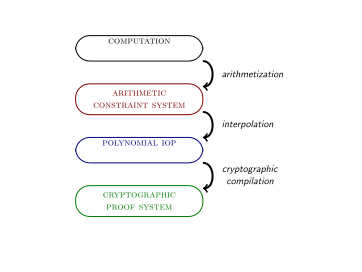
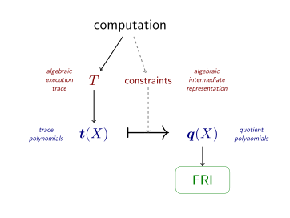

# Anatomy of a STARK, Part 1: STARK Overview

STARKs are a class of interactive proof systems, but for the purpose of this tutorial it's good to think of them as a special case of SNARKs in which
 - hash functions are the only cryptographic ingredient,
 - arithmetization is based on AIR (algebraic intermediate representation [^1]), and reduces the claim about computational integrity to one about the low degree of certain polynomials
 - the low degree of polynomials is proven by using FRI as a subprotocol, and FRI itself is instantiated with Merkle trees [^2];
 - zero-knowledge is optional.

This part of the tutorial is about explaining the key terms in this definition of STARKs.

## Interactive Proof Systems

 In computational complexity theory, an interactive proof system is a protocol between at least two parties in which one party, the verifier, is convinced of the correctness of a certain mathematical claim if and only if that claim is true. In theory, the claim could be anything expressible by mathematical symbols, such as the Birch and Swinnerton-Dyer conjecture, $\mathbf{P} \neq \mathbf{NP}$, or "the fifteenth Fibonacci number is 643617." (In a sound proof system, the verifier will reject that last claim.) 
 
 A cryptographic proof system turns this abstract notion of interactive proof systems into a concrete object intended for deployment in the real world. This restriction to real world applications induces a couple of simplifications:
  - The claim is not about a mathematical conjecture but concerns the integrity of a particular computation, like "circuit $C$ gives output $y$ when evaluated on input $x$", or "Turing machine $M$ outputs $y$ after $T$ steps". The proof system is said to establish *computational integrity*.
  - There are two parties to the protocol, the prover and the verifier. Without loss of generality the messages sent by the verifier to the prover consist of unadulterated randomness and in this case (so: almost always) the proof system can be made non-interactive with the *Fiat-Shamir transform*. Non-interactive proof systems consist of a single message from the prover to the verifier.
  - Instead of perfect security, it is acceptable for the verifier to have a nonzero but negligibly small false positive or false negative rate. Alternatively, it is acceptable for the proof system to offer security only against provers whose computational power is bounded. After all, all computers are computationally bounded in practice. Sometimes authors use the term *argument system* to distinguish the protocol from a proof system that offers security against computationally unbounded provers, and *argument* for the transcript resulting from the non-interactivity transform.
  - There has to be a compelling reason why the verifier cannot naïvely re-run the computation whose integrity is asserted by the computational integrity claim. This is because the prover has access to resources that the verifier does not have access to.
    - When the restricted resource is time, the verifier should run an order of magnitude faster than a naïve re-execution of the program. Proof systems that achieve this property are said to be *succinct* or have *succinct verification*.
    - Succinct verification requires short proofs, but some proof systems like [Bulletproofs](https://eprint.iacr.org/2017/1066.pdf) or [Aurora](https://eprint.iacr.org/2018/828.pdf) feature compact proofs but still have slow verifiers.
    - When the verifier has no access to secret information that is available to the prover, and when the proof system protects the confidentiality of this secret, the proof system satisfies *zero-knowledge*. The verifier is convinced of the truth of a computational claim while learning no information about some or all of the inputs to that computation.
 - Especially in the context of zero-knowledge proof systems, the computational integrity claim may need a subtle amendment. In some contexts it is not enough to prove the correctness of a claim, but the prover must additionally prove that he *knows* the secret additional input, and could as well have outputted the secret directly instead of producing the proof.[^3] Proof systems that achieve this stronger notion of soundness called knowledge-soundness are called *proofs (or arguments) of knowledge*.

A SNARK is a *Succinct Non-interactive ARgument of Knowledge*. The [paper](https://eprint.iacr.org/2011/443.pdf) that coined the term SNARK used *succinct* to denote proof system with efficient verifiers. However, in recent years the meaning of the term has been diluted to include any system whose proofs are compact. This tutorial takes the side of the original definition.

## STARK Overview

The acronym STARK stands for Scalable Transparent ARgument of Knowledge. *Scalable* refers to the fact that that two things occur simultaneously: (1) the prover has a running time that is at most quasilinear in the size of the computation, in contrast to SNARKs where the prover is allowed to have a prohibitively expensive complexity, and (2) verification time is poly-logarithmic in the size of the computation. *Transparent* refers to the fact that all verifier messages are just publicly sampled random coins. In particular, no trusted setup procedure is needed to instantiate the proof system, and hence there is no cryptographic toxic waste. The acronym's denotation suggests that non-interactive STARKs are a subclass of SNARKs, and indeed they are, but the term is generally used to refer to a *specific* construction for scalable transparent SNARKs.

The particular qualities of this construction are best illustrated in the context of the compilation pipeline. Depending on the level of granularity, one might opt to subdivide this process into more or fewer steps. For the purpose of introducing STARKs, the compilation pipeline is divided into four stages and three transformations. Later on in this tutorial there will be a much more fine-grained pipeline and diagram.

### Computation
The input to the entire pipeline is a *computation*, which you can think of as a program, an input, and an output. All three are provided in a machine-friendly format, such as a list of bytes. In general, the program consists of instructions that determine how a machine manipulates its resources. If the right list of instructions can simulate an arbitrary Turing machine, then the machine architecture is Turing-complete.

In this tutorial the program is hardcoded into the machine architecture. As a result, the space of allowable computations is rather limited. Nevertheless, the inputs and outputs remain variable.

The *resources* that a computation requires could be *time*, *memory*, *randomness*, *secret information*, *parallelism*. The goal is to transform the computation into a format that enables resource-constrained verifier to verify its integrity. It is possible to study more types of resources still, such as entangled qubits, non-determinism, or oracles that compute a given black box function, but the resulting questions are typically the subject of computational complexity theory rather than cryptographical practice.

### Arithmetization and Arithmetic Constraint System
The first transformation in the pipeline is known as *arithmetization*. In this procedure, the sequence of elementary logical and arithmetical operations on strings of bits is transformed into a sequence of native finite field operations on finite field elements, such that the two represent the same computation. The output is an arithmetic constraint system, essentially a bunch of equations with coefficients and variables taking values from the finite field. The computation is integral *if and only if* the constraint system has a satisfying solution -- meaning, a single assignment to the variables such that all the equations hold.

The STARK proof system arithmetizes a computation as follows. At any point in time, the state of the computation is contained in a tuple of $\mathsf{w}$ registers that take values from the finite field $\mathbb{F}$. The machine defines a *state transition function* $f : \mathbb{F}^\mathsf{w} \rightarrow \mathbb{F}^\mathsf{w}$ that updates the state every cycle. The *algebraic execution trace (AET)* is the list of all state tuples in chronological order.

The arithmetic constraint system defines at least two types of constraints on the algebraic execution trace:

 - *Boundary constraints*: at the start or at the end of the computation an indicated register has a given value.
 - *Transition constraints*: any two consecutive state tuples evolved in accordance with the state transition function.

Collectively, these constraints are known as the *algebraic intermediate representation*, or *AIR*. Advanced STARKs may define more constraint types in order to deal with memory or with consistency of registers within one cycle.

### Interpolation and Polynomial IOPs

Interpolation in the usual sense means finding a polynomial that passes through a set of data points. In the context of the STARK compilation pipeline, *interpolation* means finding a representation of the arithmetic constraint system in terms of polynomials. The resulting object is not an arithmetic constraint system but an abstract protocol called a *Polynomial IOP*.

The prover in a regular proof system sends messages to the verifier. But what happens when the verifier is not allowed to read them? Specifically, if the messages from the prover are replaced by oracles, abstract black-box functionalities that the verifier can query in points of his choosing, the protocol is an *interactive oracle proof (IOP)*. When the oracles correspond to polynomials of low degree, it is a *Polynomial IOP*. The intuition is that the honest prover obtains a polynomial constraint system whose equations hold, and that the cheating prover must use a constraint system where at least one equation is false. When polynomials are equal, they are equal everywhere, and in particular in random points of the verifier's choosing. But when polynomials are unequal, they are unequal *almost* everywhere, and this inequality is exposed with high probability when the verifier probes the left and right hand sides in a random point.

The STARK proof system interpolates the algebraic execution trace literally -- that is to say, it finds $\mathsf{w}$ polynomials $t_i(X)$ such that the values $t_i(X)$ takes on a domain $D$ correspond to the algebraic execution trace of the $i$th register. These polynomials are sent as oracles to the verifier. At this point the AIR constraints give rise to operations on polynomials that send low-degree polynomials to low-degree polynomials only if the constraints are satisfied. The verifier simulates these operations and can thus derive new polynomials whose low degree certifies the satisfiability of the constraint system, and thus the integrity of the computation. In other words, the interpolation step reduces the satisfiability of an arithmetic constraint system to a claim about the low degree of certain polynomials.

### Cryptographic Compilation with FRI

In the real world, polynomial oracles do not exist. The protocol designer who wants to use a Polynomial IOP as an intermediate stage must find a way to commit to a polynomial and then open that polynomial in a point of the verifier's choosing. FRI is a key component of a STARK proof that achieves this task by using Merkle trees of Reed-Solomon Codewords to prove the boundedness of a polynomial's degree.

The Reed-Solomon codeword associated with a polynomial $f(X) \in \mathbb{F}[X]$ is the list of values it takes on a given domain $D \subset \mathbb{F}$. Consider without loss of generality domains $D$ whose cardinality is larger than the maximum allowable degree for polynomials. These values can be put into a Merkle tree, in which case the root represents a commitment to the polynomial. The *Fast Reed-Solomon IOP of Proximity (FRI)* is a protocol whose prover sends a sequence of Merkle roots corresponding to codewords whose lengths halve in every iteration. The verifier inspects the Merkle trees (specifically: asks the prover to provide the indicated leafs with their authentication paths) of consecutive rounds to test a simple linear relation. For honest provers, the degree of the represented polynomials likewise halves in each round, and is thus much smaller than the length of the codeword. However for malicious provers this degree is one less than the length of the codeword. In the last step, the prover sends a non-trivial codeword corresponding to a constant polynomial.

There is a minor issue the above description does not capture: how does the verifier query a committed polynomial $f(X)$ in a point $z$ that does not belong to the domain? In principle, there is an obvious and straightforward solution: the verifier sends $z$ to the prover, and the prover responds by sending $y=f(z)$. The polynomial $f(X) - y$ has a zero in $X=z$ and so must be divisible by $X-z$. So both prover and verifier have access to a new low degree polynomial, $\frac{f(X) - y}{X-z}$. If the prover was lying about $f(z)=y$, then he is incapable of proving the low degree of $\frac{f(X) - y}{X-z}$, and so his fraud will be exposed in the course of the FRI protocol. This is in fact the exact mechanism that enforces the boundary constraints; a slightly more involved but similar construction enforces the transition constraints. The new polynomials are the result of dividing out known factors, so they will be called *quotients* and denoted $q_i(X)$.

At this point the Polynomial IOP has been compiled into an interactive concrete proof system. In principle, the protocol could be executed. However, it pays to do one more step of cryptographic compilation: replace the verifier's random coins (AKA. *randomness*) by something pseudorandom -- but deterministic. This is exactly the Fiat-Shamir transform, and the result is the non-interactive proof known as the STARK.

This description glosses over many details. The remainder of this tutorial will explain the construction in more concrete and tangible terms, and will insert more fine-grained components into the diagram.

[0](index) - **1** - [2](basic-tools) - [3](fri) - [4](stark) - [5](rescue-prime) - [6](faster)

[^1]: Also, algebraic *internal* representation.
[^2]: Note that FRI is defined in terms of abstract oracles which can be queried in arbitrary locations; a FRI protocol can thus be compiled into a concrete protocol by simulating the oracles with any cryptographic vector commitment scheme. Merkle trees provide this functionality but are not the only cryptographic primitive to do it.
[^3]: Formally, *knowledge* is defines as follows: an extractor algorithm must exist which has oracle access to a possibly-malicious prover, pretends to be the matching verifier (and in particular reads the messages coming from the prover and sends its own via the same interface), has the power to rewind the possibly-malicious prover to any earlier point in time, runs in polynomial time, and outputs the witness. STARKs have been shown to satisfy this property, see section 5 of the [EthSTARK documentation](https://eprint.iacr.org/2021/582.pdf).
