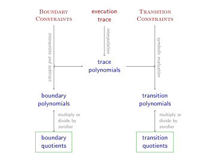
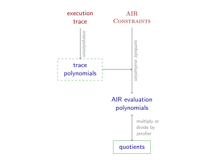

# Anatomy of a STARK, Part 4: The STARK Polynomial IOP

This part of the tutorial deals with the information-theoretic backbone of the STARK proof system, which you might call the STARK Polynomial IOP. Recall that the compilation pipeline of SNARKs involves intermediate stages, the first two of which are the *arithmetic constraint system* and the *Polynomial IOP*. This tutorial does describe the properties of the arithmetic constraint system. However, a discussion about the *arithmetization* step, which transforms the initial computation into an arithmetic constraint system, is out of scope. The *interpolation* step, which transforms this arithmetic constraint system into a Polynomial IOP, is discussed at length. The final Polynomial IOP can be compiled into a concrete proof system using the FRI-based compiler described in [part 3](fri).

## Arithmetic Intermediate Representation (AIR)

The *arithmetic intermediate representation (AIR)* (also, arithmetic *internal* representation) is a way of describing a computation in terms of an execution trace that satisfies a number of constraints induced by the correct evolution of the state. The term *arithmetic* refers to the fact that this execution trace consists of a list of finite field elements (or an array, if more than one register is involved), and that the constraints are expressible as low degree polynomials.

Let's make this more concrete. Let $\mathbb{F}_p$ be the field of definition. Without loss of generality, the computation describes the evolution a *state* of $\mathsf{w}$ registers for $T$ cycles. The *algebraic execution trace (AET)* is the table of $T \times \mathsf{w}$ field elements where every row describes the state of the system at the given point in time, and every column tracks the value of the given register.

A *state transition function* 

$$f : \mathbb{F}_p^\mathsf{w} \rightarrow \mathbb{F}_p^\mathsf{w} $$

determines the state at the next cycle as a function of the state at the previous cycle. Furthermore, a list of boundary conditions 

$$ \mathcal{B} : [\mathbb{Z}_T \times \mathbb{Z}_\mathsf{w} \times \mathbb{F}] $$

enforce the correct values of some or all registers at the first cycle, last cycle, or even at arbitrary cycles.

The *computational integrity claim* consists of the state transition function and the boundary conditions. The *witness* to this claim is the algebraic execution trace. The claim is *true* if there is a witness $W \in \mathbb{G}^{T \times \mathsf{w}}$ such that:
 - for every cycle, the state evolves correctly: $\forall i \in \lbrace 0, \ldots, T-1 \rbrace \, . \, f(W_{[i,:]}) = W_{[i+1,:]}$; and
 - all boundary conditions are satisfied: $\forall (i, w, e) \in \mathcal{B} \, . \, W_{[i,w]} = e$.

The state transition function hides a lot of complexity. For the purpose of STARKs, it needs to be describable as low degree polynomials that are *independent of the cycle*. However, this list of polynomials does not need to compute the next state from the current one; it merely needs to distinguish correct evolutions from incorrect ones. Specifically, the function 

$$ f : \mathbb{F}_p^\mathsf{w} \rightarrow \mathbb{F}_p^\mathsf{w} $$

is represented by a list of polynomials $\mathbf{p}(X_0, \ldots, X_{\mathsf{w}-1}, Y_{0}, \ldots, Y_{ \mathsf{w}-1})$ such that $f(\mathbf{x}) = \mathbf{y}$ if and only if $\mathbf{p}(\mathbf{x}, \mathbf{y}) = \mathbf{0}$. Say there are $r$ such state transition verification polynomials. Then the transition constraints become:
 - $\forall i \in \lbrace 0, \ldots, T - 1 \rbrace \, . \, \forall j \in \lbrace 0, \ldots, r-1\rbrace \, . \, p_j(W_{[i,0]}, \ldots, W_{[i, \mathsf{w}-1]}, W_{[i+1,0]}, \ldots, W_{[i+1, \mathsf{w}-1]}) = 0$.

This representation admits *non-determinism*, which has the capacity to reduce high degree state transition *computation* polynomials with low degree state transition *verification* polynomials. For example: the state transition function $f : \mathbb{F}_p \rightarrow \mathbb{F}_p$ given by
$$ x \mapsto \left\lbrace  \begin{array}{l}
x^{-1} & \Leftarrow x \neq 0 \\
0 & \Leftarrow x = 0 
\end{array} \right. $$
can be represented as a computation polynomial $f(x) = x^{p-2}$ or as a pair of verification polynomials $\mathbf{p}(x,y) = (x(xy-1), y(xy-1))$. The degree drops from $p-2$ to 3.

Not all lists of $\mathsf{w}$ represent valid states. For instance, some registers may be constrained to bits and thus take only values from $\lbrace 0, 1\rbrace$. The state transition function is what guarantees that the next state is well-formed if the current state is. When translating to verification polynomials, these *consistency constraints* are polynomials in the first half of variables only ($X_0, \ldots, X_{\mathsf{w}-1}$) because they apply to every single row in the AET, as opposed to every consecutive pair of rows. For the sake of simplicity, this tutorial will ignore consistency constraints and pretend as though every $\mathsf{w}$-tuple of field elements represents a valid state.

## Interpolation

The arithmetic constraint system described above already represents the computational integrity claim as a bunch of polynomials; each such polynomial corresponds to a constraint. Transforming this constraint system into a Polynomial IOP requires extending this representation in terms of polynomials to the witness and extending the notion of *valid* witnesses to *witness polynomials*. Specifically, we need to represent the conditions for true computational integrity claims in terms of identities of polynomials.

Let $D$ be a list of points referred to from here on out as the *trace evaluation domain*. Typically, $D$ is set to the span of a generator $\omicron$ of a subgroup of order $2^k \geq T+1$. So for the time being set $D = \lbrace \omicron^i \vert i \in \mathbb{Z}\rbrace$. The Greek letter $\omicron$ ("omicron") indicates that the trace evaluation domain is smaller than the FRI evaluation domain by a factor exactly equal to the expansion factor[^1].

Let $\boldsymbol{t}(X) \in (\mathbb{F}_p[X])^\mathsf{w}$ be a list of $\mathsf{w}$ univariate polynomials that interpolate through $W$ on $D$. Specifically, the *trace polynomial* $t_w(X)$ for register $w$ is the univariate polynomial of lowest degree such that $\forall i \in \lbrace 0, \ldots, T\rbrace \, . \, t_w(\omicron^i) = W[i, w]$. The trace polynomials are a representation of the algebraic execution trace in terms of univariate polynomials.

Translating the conditions for true computational integrity claims to the trace polynomials, one gets:
 - all boundary constraints are satisfied: $\forall (i, w, e) \in \mathcal{B} \, . \, t_w(\omicron^i) = e$; and
 - for all cycles, all transition constraints are satisfied: $\forall i \in \lbrace 0, \ldots, T-1 \rbrace \, . \, \forall j \in \lbrace 0, \ldots, r-1 \rbrace \, . \, p_j( t_0(\omicron^i), \ldots, t_{\mathsf{w}-1}(\omicron^i), t_0(\omicron^{i+1}), \ldots, t_{\mathsf{w}-1}(\omicron^{i+1})) = 0$.

The last expression looks complicated. However, observe that the left hand side of the equation corresponds to the univariate polynomial $p_j(t_0(X)), \ldots, t_{\mathsf{w}-1}(X), t_0(\omicron \cdot X), \ldots, t_{\mathsf{w}-1}(\omicron \cdot X))$. The entire expression simply says that all $r$ of these *transition polynomials* evaluate to 0 in $\lbrace  \omicron^i \vert i \in \mathbb{Z}_T\rbrace$.

This observation gives rise to the following high-level Polynomial IOP:
 1. The prover commits to the trace polynomials $\boldsymbol{t}(X)$.
 2. The verifier checks that $t_w(X)$ evaluates to $e$ in $\omicron^i$ for all $(i, w, e) \in \mathcal{B}$.
 3. The prover commits to the transition polynomials $\mathbf{c}(X) = \mathbf{p}(t_0(X)), \ldots, t_{\mathsf{w}-1}(X), t_0(\omicron \cdot X), \ldots, t_{\mathsf{w}-1}(\omicron \cdot X))$.
 4. The verifier checks that $\mathbf{c}(X)$ and $\boldsymbol{t}(X)$ are correctly related by:
   - choosing a random point $z$ drawn uniformly from the field excluding the element 0,
   - querying the values of $\boldsymbol{t}(X)$ in $z$ and $\omicron \cdot z$,
   - evaluating the transition verification polynomials $\mathbf{p}(X_1, \ldots, X_{\mathsf{w}-1}, Y_0, \ldots, Y_{\mathsf{w}-1})$ in these $2\mathsf{w}$ points, and
   - querying the values of $\mathbf{c}(X)$ in $z$,
   - checking that the values obtained in the previous two steps match.
 5. The verifier checks that the transition polynomials $\mathbf{c}(X)$ evaluate to zero in $\lbrace \omicron^i \vert i \in \lbrace 0, \ldots, T-1 \rbrace \rbrace$.

In fact, the commitment of the transition polynomials can be omitted. Instead, the verifier uses the evaluation of $\boldsymbol{t}(X)$ in $z$ and $\omicron \cdot z$ to compute the value of $\mathbf{c}(X)$ in the one point needed to verify that $\mathbf{c}(X)$ evaluates to 0 in $\lbrace  \omicron^i \vert i \in \lbrace 0, \ldots, T-1 \rbrace \rbrace$.

There is another layer of redundancy, but it is only apparent after the evaluation checks are unrolled. The FRI compiler simulates an evaluation check by a) subtracting the y-coordinate, b) dividing out the zerofier, which is the minimal polynomial that vanishes at the x-coordinate, and c) proving that the resulting quotient has a bounded degree. This procedure happens twice for the STARK polynomials -- first: applied to the trace polynomials to show satisfaction of the boundary constraints, and second: applied to the transition polynomials to show that the transition constraints are satisfied. We call the resulting lists of quotient polynomials the *boundary quotients* and the *transition quotients* respectively.

The redundancy comes from the fact that the trace polynomials relate to both quotients. It can therefore be eliminated by merging the equations they are involved in. The next diagram illustrates this elimination in the context of the STARK Polynomial IOP workflow. The green box indicates that the polynomials are committed to through the familiar evaluation and Merkle root procedure and are provided as input to FRI.



At the top of this diagram in red are the objects associated with the arithmetic constraint system, with the constraints written in small caps font to indicate that they are known to the verifier. The prover interpolates the execution trace to obtain the trace polynomials, but it is not necessary to commit to these polynomials. Instead, the prover interpolates the boundary points and subtracts the resulting interpolants from the trace polynomials. This procedure produces the *dense trace polynomials*, for lack of a better name. To obtain the boundary quotients from the dense trace polynomials, the prover divides out the zerofier. Note that the boundary quotients and trace polynomials are equivalent in the following sense: if the verifier knows a value in a given point of one, he can compute the matching value of the other using only public information.

To obtain the transition polynomials, the prover evaluates the transition constraints (recall, these are given as multivariate polynomials) symbolically in the trace polynomials. To get the transition quotients from the transition polynomials, divide out the zerofier. Assume for the time being that the verifier is capable of evaluating this zerofier efficiently. Note that the transition quotients and the trace polynomials are not equivalent -- the verifier cannot necessarily undo the symbolic evaluation. However, this non-equivalence does not matter. What the verifier needs to verify is that the boundary quotients and the transition quotients are linked. Traveling from the boundary quotients to the transition quotients, and performing the indicated arithmetic along the way, establishes this link. The remaining part of the entire computational integrity claim is the bounded degree of the quotient polynomials, and this is exactly what FRI already solves.

The use of the plural on the right hand side is slightly misleading. After the boundary quotients have been committed to by sending their Merkle roots to the verifier, the prover obtains from the verifier random weights with which to compress the transition constraints to a single linear combination. As a result of this compression, there is one transition constraint, one transition polynomial, and one transition quotient. Nevertheless, this compression may be omitted without affecting security; it merely requires more work on the part of both the prover and the verifier.

To summarize, this workflow generates two recipes: one for the prover and one for the verifier. They are presented here in abstract terms and in interactive form.

Prover:
 - Interpolate the execution trace to obtain the trace polynomials.
 - Interpolate the boundary points to obtain the boundary interpolants, and compute the boundary zerofiers along the way.
 - Subtract the boundary interpolants from the trace polynomials, giving rise to the dense trace polynomials.
 - Divide out the boundary zerofiers from the dense trace polynomials.
 - Commit to the dense trace polynomials.
 - Get $r$ random coefficients from the verifier.
 - Compress the $r$ transition constraints into one master constraint that is the weighted sum.
 - Symbolically evaluate the master constraint in the trace polynomials, thus generating the transition polynomial.
 - Divide out the transition zerofier to get the transition quotient.
 - Commit to the transition zerofier.
 - Run FRI on all committed polynomials.
 - Supply the Merkle leafs and authentication paths that are requested by the verifier.

Verifier:
 - Read the commitments to the boundary quotients.
 - Supply the random coefficients for the master transition constraint.
 - Read the commitment to the transition quotient.
 - Run the FRI verifier.
 - Verify the link between boundary quotients and transition quotient. To do this:
   - For all points of the transition quotient codeword that were queried in the first round of FRI do:
     - Let the point be $(x, y)$.
     - Query the matching points on the boundary quotient codewords. Note that there are two of them, $x$ and $\omicron \cdot x$, indicating points "one cycle apart".
     - Multiply the y-coordinates of these points by the zerofiers' values in $x$ and $\omicron \cdot x$.
     - Add the boundary interpolants' values.
     - Evaluate the master transition constraint in this point.
     - Divide by the value of the transition zerofier in $x$.
     - Verify that the resulting value equals $y$.

## Generalized AIR Constraints

The description so far makes a clear distinction between transition constraints on the one hand, and boundary constraints on the other hand. However, there is a unifying perspective that characterizes both as cleanly dividing ratios of polynomials. More accurately, the denominator divides the numerator cleanly if the computation is integral; otherwise, there is a nonzero remainder.

Such a generalized AIR constraint is given by two polynomials.
 - The *numerator* determines which equations between elements of the algebraic execution trace hold, in a manner that is independent of the cycle. For transition constraints, the numerator is exactly the transition constraint polynomial. For boundary constraints, the numerator is simply $t_ i(X) - y$ where $y$ is supposedly the value of $t_ i(X)$ at the given boundary.
 - The *denominator* is a zerofier that determines *where* the equality is supposed to hold, by vanishing (*i.e.*, evaluating to zero) in those points. For transition constraints, this zerofier vanishes on all points of the trace evaluation domain except the last. For the boundary constraints, this zerofier vanishes only on the boundary.

Treating boundary constraints and transition constraints as subclasses of generalized AIR constraints, leads to a simpler workflow diagram. Now, the prover commits to the raw trace polynomials, but these polynomials are not input to the FRI subprotocol. Instead, they are used to only verify that the leafs of the first Merkle tree of FRI were computed correctly.



The implementation of this tutorial follows the earlier workflow, which separates boundary constraints from transition constraints, rather than the workflow informed by a generalized notion of AIR constraints.

## Adding Zero-Knowledge

Formally, an interactive proof system is *zero-knowledge* if the distribution of transcripts arising from authentic executions of the protocol is independent of the witness and can be sampled efficiently with public information only. In practice, this means that the prover randomizes the data structures and proof arithmetic using randomness that also remains secret. The transcript is independent of the witness because *any* transcript can be explained by the right choice of randomizers.

With respect to randomizing the STARK proof system, it is worth separating the mechanism into two parts and randomize them separately.
 1. The FRI bounded degree proof. This component is randomized by adding a randomizer codeword to the nonlinear combination. This randomizer codeword corresponds to a polynomial of maximal degree whose coefficients are drawn uniformly at random.
 2. The linking part that establishes that the boundary quotients are linked to the transition quotient(s). To randomize this, the execution trace for every register is extended with $4s$ uniformly random field elements. The number $4s$ comes from the number $s$ of colinearity checks in the FRI protocol: every colinearity check induces two queries in the initial codeword. The two values of the transition quotient codeword need to be linked two four values of the boundary quotient codewords.

It is important to guarantee that none of the x-coordinates that are queried as part of FRI correspond to x-coordinates used for interpolating the execution trace. This is one of the reasons why coset-FRI comes in handy. Nevertheless, other solutions can address this problem.

Lastly, if the field is not large enough (specifically, if its cardinality is significantly less than $2^\lambda$ for security level $\lambda$), then salts need to be appended to the leafs when building the Merkle tree. Specifically, every leaf needs $\lambda$ bits of randomness, and if it does not come from the field element then it must come from an explicit appendix.

Without leaf salts, the Merkle tree and its paths are deterministic for a given codeword. This codeword is still somewhat random, because the polynomial that generates it has randomizers. However, every leaf has at most $\vert \mathbb{F}_ p \vert$ bits of entropy, and when this number of smaller than $\lambda$, the attacker is likely to find duplicate hash digests. In other words, he can notice, with less than $2^\lambda$ work, that the same value is being input to the hash function. This observation leads to a distinguisher between authentic and simulated transcript, which in turn undermines zero-knowledge.

The code presented here omits leaf salts because the field is large enough.

## Implementation

Like the FRI module, the STARK module starts with an initializer function that sets the class's fields to the initialization arguments or values inferred from them.

```python
from functools import reduce
import os

class Stark:
    def __init__( self, field, expansion_factor, num_colinearity_checks, security_level, num_registers, num_cycles, transition_constraints_degree=2 ):
        assert(len(bin(field.p)) - 2 >= security_level), "p must have at least as many bits as security level"
        assert(expansion_factor & (expansion_factor - 1) == 0), "expansion factor must be a power of 2"
        assert(expansion_factor >= 4), "expansion factor must be 4 or greater"
        assert(num_colinearity_checks * 2 >= security_level), "number of colinearity checks must be at least half of security level"

        self.field = field
        self.expansion_factor = expansion_factor
        self.num_colinearity_checks = num_colinearity_checks
        self.security_level = security_level

        self.num_randomizers = 4*num_colinearity_checks

        self.num_registers = num_registers
        self.original_trace_length = num_cycles
        
        randomized_trace_length = self.original_trace_length + self.num_randomizers
        omicron_domain_length = 1 << len(bin(randomized_trace_length * transition_constraints_degree)[2:])
        fri_domain_length = omicron_domain_length * expansion_factor

        self.generator = self.field.generator()
        self.omega = self.field.primitive_nth_root(fri_domain_length)
        self.omicron = self.field.primitive_nth_root(omicron_domain_length)
        self.omicron_domain = [self.omicron^i for i in range(omicron_domain_length)]

        self.fri = Fri(self.generator, self.omega, fri_domain_length, self.expansion_factor, self.num_colinearity_checks)
```

The code makes a distinction between the *original trace length*, which is one greater than the number of cycles, and the *randomized trace length* which the previous variable with $4s$ randomizers extra. A third related variable is the `omicron_domain`, which is the list of points in the subgroup of order $2^k$ where $k$ is the smallest integer such that this domain is still larger than or equal to the randomized trace length.

Next up are the helper functions. First are the degree bounds calculators for a) transition polynomials; b) transition quotient polynomials; and c) the nonlinear random combination of polynomials that goes into FRI. This last number is one less than the next power of two.

```python
    def transition_degree_bounds( self, transition_constraints ):
        point_degrees = [1] + [self.original_trace_length+self.num_randomizers-1] * 2*self.num_regisers
        return [max( sum(r*l for r, l in zip(point_degrees, k)) for k, v in a.dictionary.items()) for a in transition_constraints]

    def transition_quotient_degree_bounds( self, transition_constraints ):
        return [d - (self.original_trace_length-1) for d in self.transition_degree_bounds(transition_constraints)]

    def max_degree( self, transition_constraints ):
        md = max(self.transition_quotient_degree_bounds(transition_constraints))
        return (1 << (len(bin(md)[2:]))) - 1
```

Note that this code is not compressing the many transition constraints into one. As a result, there are many transition polynomials and many transition quotients.

Up next are zerofier polynomials, which come in two categories: boundary zerofiers and transition zerofiers.

```python
    def transition_zerofier( self ):
        domain = self.omicron_domain[0:(self.original_trace_length-1)]
        return Polynomial.zerofier_domain(domain)

    def boundary_zerofiers( self, boundary ):
        zerofiers = []
        for s in range(self.num_regisers):
            points = [self.omicron^c for c, r, v in boundary if r == s]
            zerofiers = zerofiers + [Polynomial.zerofier_domain(points)]
        return zerofiers
```

The next function computes polynomials that interpolate through the (location,value)-pairs of the boundary conditions. This function also enables a boundary counterpart to the transition quotient degree bounds calculator.

```python
    def boundary_interpolants( self, boundary ):
        interpolants = []
        for s in range(self.num_regisers):
            points = [(c,v) for c, r, v in boundary if r == s]
            domain = [self.omicron^c for c,v in points]
            values = [v for c,v in points]
            interpolants = interpolants + [Polynomial.interpolate_domain(domain, values)]
        return interpolants

    def boundary_quotient_degree_bounds( self, randomized_trace_length, boundary ):
        randomized_trace_degree = randomized_trace_length - 1
        return [randomized_trace_degree - bz.degree() for bz in self.boundary_zerofiers(boundary)]
```

The last helper function is used by prover and verifier when they want to transform a seed, obtained from the Fiat-Shamir transform, into a list of field elements. The resulting field elements are used as weights in the nonlinear combination of polynomials before starting FRI.

```python
    def sample_weights( self, number, randomness ):
        return [self.field.sample(blake2b(randomness + bytes(i)).digest()) for i in range(0, number)]
```

### Prove

Next up is the prover. The big difference with respect to the explanation above is that there is no compression of transition constraints into one master constraint. This task is left as an exercise to the reader.

Another difference is that the transition constraints have $2\mathsf{w}+1$ variables rather than $2\mathsf{w}$. The extra variable takes the value of the evaluation domain over which the execution trace is interpolated. This feature anticipates constraints that depend on the cycle, for instance to evaluate a hash function that uses round constants that are different in each round.

```python
    def prove( self, trace, transition_constraints, boundary, proof_stream=None ):
        # create proof stream object if necessary
        if proof_stream == None:
            proof_stream = ProofStream()
        
        # concatenate randomizers
        for k in range(self.num_randomizers):
            trace = trace + [[self.field.sample(os.urandom(17)) for s in range(self.num_registers)]]

        # interpolate
        trace_domain = [self.omicron^i for i in range(len(trace))]
        trace_polynomials = []
        for s in range(self.num_registers):
            single_trace = [trace[c][s] for c in range(len(trace))]
            trace_polynomials = trace_polynomials + [Polynomial.interpolate_domain(trace_domain, single_trace)]

        # subtract boundary interpolants and divide out boundary zerofiers
        boundary_quotients = []
        for s in range(self.num_registers):
            interpolant = self.boundary_interpolants(boundary)[s]
            zerofier = self.boundary_zerofiers(boundary)[s]
            quotient = (trace_polynomials[s] - interpolant) / zerofier
            boundary_quotients += [quotient]

        # commit to boundary quotients
        fri_domain = self.fri.eval_domain()
        boundary_quotient_codewords = []
        boundary_quotient_Merkle_roots = []
        for s in range(self.num_registers):
            boundary_quotient_codewords = boundary_quotient_codewords + [boundary_quotients[s].evaluate_domain(fri_domain)]
            merkle_root = Merkle.commit(boundary_quotient_codewords[s])
            proof_stream.push(merkle_root)

        # symbolically evaluate transition constraints
        point = [Polynomial([self.field.zero(), self.field.one()])] + trace_polynomials + [tp.scale(self.omicron) for tp in trace_polynomials]
        transition_polynomials = [a.evaluate_symbolic(point) for a in transition_constraints]

        # divide out zerofier
        transition_quotients = [tp / self.transition_zerofier() for tp in transition_polynomials]

        # commit to randomizer polynomial
        randomizer_polynomial = Polynomial([self.field.sample(os.urandom(17)) for i in range(self.max_degree(transition_constraints)+1)])
        randomizer_codeword = randomizer_polynomial.evaluate_domain(fri_domain) 
        randomizer_root = Merkle.commit(randomizer_codeword)
        proof_stream.push(randomizer_root)

        # get weights for nonlinear combination
        #  - 1 randomizer
        #  - 2 for every transition quotient
        #  - 2 for every boundary quotient
        weights = self.sample_weights(1 + 2*len(transition_quotients) + 2*len(boundary_quotients), proof_stream.prover_fiat_shamir())

        assert([tq.degree() for tq in transition_quotients] == self.transition_quotient_degree_bounds(transition_constraints)), "transition quotient degrees do not match with expectation"

        # compute terms of nonlinear combination polynomial
        x = Polynomial([self.field.zero(), self.field.one()])
        terms = []
        terms += [randomizer_polynomial]
        for i in range(len(transition_quotients)):
            terms += [transition_quotients[i]]
            shift = self.max_degree(transition_constraints) - self.transition_quotient_degree_bounds(transition_constraints)[i]
            terms += [(x^shift) * transition_quotients[i]]
        for i in range(self.num_registers):
            terms += [boundary_quotients[i]]
            shift = self.max_degree(transition_constraints) - self.boundary_quotient_degree_bounds(len(trace), boundary)[i]
            terms += [(x^shift) * boundary_quotients[i]]

        # take weighted sum
        # combination = sum(weights[i] * terms[i] for all i)
        combination = reduce(lambda a, b : a+b, [Polynomial([weights[i]]) * terms[i] for i in range(len(terms))], Polynomial([]))

        # compute matching codeword
        combined_codeword = combination.evaluate_domain(fri_domain)

        # prove low degree of combination polynomial
        indices = self.fri.prove(combined_codeword, proof_stream)
        indices.sort()
        duplicated_indices = [i for i in indices] + [(i + self.expansion_factor) % self.fri.domain_length for i in indices]

        # open indicated positions in the boundary quotient codewords
        for bqc in boundary_quotient_codewords:
            for i in duplicated_indices:
                proof_stream.push(bqc[i])
                path = Merkle.open(i, bqc)
                proof_stream.push(path)

        # ... as well as in the randomizer
        for i in indices:
            proof_stream.push(randomizer_codeword[i])
            path = Merkle.open(i, randomizer_codeword)
            proof_stream.push(path)

        # the final proof is just the serialized stream
        return proof_stream.serialize()
```

### Verify

Last is the verifier. It comes with the same caveat and exercise.

```python
    def verify( self, proof, transition_constraints, boundary, proof_stream=None ):
        H = blake2b

        # infer trace length from boundary conditions
        original_trace_length = 1 + max(c for c, r, v in boundary)
        randomized_trace_length = original_trace_length + self.num_randomizers

        # deserialize with right proof stream
        if proof_stream == None:
            proof_stream = ProofStream()
        proof_stream = proof_stream.deserialize(proof)

        # get Merkle roots of boundary quotient codewords
        boundary_quotient_roots = []
        for s in range(self.num_registers):
            boundary_quotient_roots = boundary_quotient_roots + [proof_stream.pull()]

        # get Merkle root of randomizer polynomial
        randomizer_root = proof_stream.pull()

        # get weights for nonlinear combination
        weights = self.sample_weights(1 + 2*len(transition_constraints) + 2*len(self.boundary_interpolants(boundary)), proof_stream.verifier_fiat_shamir())

        # verify low degree of combination polynomial
        polynomial_values = []
        verifier_accepts = self.fri.verify(proof_stream, polynomial_values)
        polynomial_values.sort(key=lambda iv : iv[0])
        if not verifier_accepts:
            return False

        indices = [i for i,v in polynomial_values]
        values = [v for i,v in polynomial_values]

        # read and verify leafs, which are elements of boundary quotient codewords
        duplicated_indices = [i for i in indices] + [(i + self.expansion_factor) % self.fri.domain_length for i in indices]
        leafs = []
        for r in range(len(boundary_quotient_roots)):
            leafs = leafs + [dict()]
            for i in duplicated_indices:
                leafs[r][i] = proof_stream.pull()
                path = proof_stream.pull()
                verifier_accepts = verifier_accepts and Merkle.verify(boundary_quotient_roots[r], i, path, leafs[r][i])
                if not verifier_accepts:
                    return False

        # read and verify randomizer leafs
        randomizer = dict()
        for i in indices:
            randomizer[i] = proof_stream.pull()
            path = proof_stream.pull()
            verifier_accepts = verifier_accepts and Merkle.verify(randomizer_root, i, path, randomizer[i])

        # verify leafs of combination polynomial
        for i in range(len(indices)):
            current_index = indices[i] # do need i

            # get trace values by applying a correction to the boundary quotient values (which are the leafs)
            domain_current_index = self.generator * (self.omega^current_index)
            next_index = (current_index + self.expansion_factor) % self.fri.domain_length
            domain_next_index = self.generator * (self.omega^next_index)
            current_trace = [self.field.zero() for s in range(self.num_registers)]
            next_trace = [self.field.zero() for s in range(self.num_registers)]
            for s in range(self.num_registers):
                zerofier = self.boundary_zerofiers(boundary)[s]
                interpolant = self.boundary_interpolants(boundary)[s]

                current_trace[s] = leafs[s][current_index] * zerofier.evaluate(domain_current_index) + interpolant.evaluate(domain_current_index)
                next_trace[s] = leafs[s][next_index] * zerofier.evaluate(domain_next_index) + interpolant.evaluate(domain_next_index)

            point = [domain_current_index] + current_trace + next_trace
            transition_constraints_values = [transition_constraints[s].evaluate(point) for s in range(len(transition_constraints))]

            # compute nonlinear combination
            counter = 0
            terms = []
            terms += [randomizer[current_index]]
            for s in range(len(transition_constraints_values)):
                tcv = transition_constraints_values[s]
                quotient = tcv / self.transition_zerofier().evaluate(domain_current_index)
                terms += [quotient]
                shift = self.max_degree(transition_constraints) - self.transition_quotient_degree_bounds(transition_constraints)[s]
                terms += [quotient * (domain_current_index^shift)]
            for s in range(self.num_registers):
                bqv = leafs[s][current_index] # boundary quotient value
                terms += [bqv]
                shift = self.max_degree(transition_constraints) - self.boundary_quotient_degree_bounds(randomized_trace_length, boundary)[s]
                terms += [bqv * (domain_current_index^shift)]
            combination = reduce(lambda a, b : a+b, [terms[j] * weights[j] for j in range(len(terms))], self.field.zero())

            # verify against combination polynomial value
            verifier_accepts = verifier_accepts and (combination == values[i])
            if not verifier_accepts:
                return False

        return verifier_accepts
```

[0](index) - [1](overview) - [2](basic-tools) - [3](fri) - **4** - [5](rescue-prime) - [6](faster)

[^1]: It is worth ensuring that the trace evaluation domain is disjoint from the FRI evaluation domain, for example by using the coset-trick. However, if overlapping subgroups are used for both domains, then $\omega^{1 / \rho} = \omicron$ and $\omega$ generates the larger domain whereas $\omicron$ generates the smaller one.
